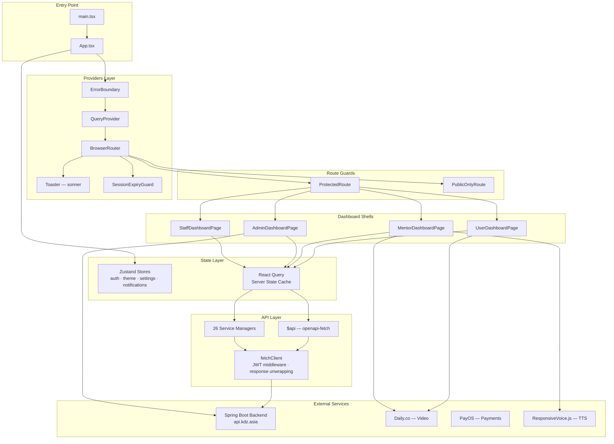

<div align="center">

# 🎙️ EXE_FE — AI Interview Platform

**Production-grade SPA for AI-powered interview preparation with multi-role dashboards, real-time video calls, and intelligent feedback.**

[](https://react.dev/)
[](https://www.typescriptlang.org/)
[](https://vite.dev/)
[](https://tailwindcss.com/)
[](https://vercel.com/)

<br />

[](#available-scripts)
[](#technology-stack)
[](#internationalization)
[](#api-layer)

</div>

---

## Table of Contents

- [Overview](#overview)
- [Features](#features)
- [Technology Stack](#technology-stack)
- [Getting Started](#getting-started)
- [Available Scripts](#available-scripts)
- [Project Structure](#project-structure)
- [Architecture](#architecture)
  - [High-Level Diagram](#high-level-diagram)
  - [Data Flow](#data-flow)
  - [State Management](#state-management)
  - [API Layer](#api-layer)
- [Routing](#routing)
  - [Public Routes](#public-routes)
  - [Auth Routes](#auth-routes)
  - [Dashboard Routes](#dashboard-routes)
  - [Error & Dev Routes](#error--dev-routes)
  - [Route Guards](#route-guards)
- [Components](#components)
  - [shadcn/ui Primitives](#shadcnui-primitives)
  - [Shared Components](#shared-components)
  - [Domain Components](#domain-components)
  - [Video Call Architecture](#video-call-architecture)
- [Custom Hooks](#custom-hooks)
- [Services Layer](#services-layer)
- [Utility Libraries](#utility-libraries)
- [Internationalization](#internationalization)
- [Styling System](#styling-system)
- [Testing](#testing)
- [Deployment](#deployment)
- [Code Quality & Conventions](#code-quality--conventions)
  - [Naming Conventions](#naming-conventions)
  - [Anti-Patterns](#anti-patterns)
- [Contributing](#contributing)
- [License](#license)

---

## Overview

**EXE_FE** is the frontend for an AI-powered interview preparation platform built with React 19, TypeScript 5.9, and Vite 7. It serves four distinct user roles — each with its own dashboard shell, navigation paradigm, and feature set.

| Role                | Route       | Navigation           | Tabs | Focus                                             |
| ------------------- | ----------- | -------------------- | ---- | ------------------------------------------------- |
| **USER** (students) | `/user/*`   | Sidebar + Breadcrumb | 13   | AI interviews, mock bookings, practice, community |
| **MENTOR**          | `/mentor/*` | Sidebar + Breadcrumb | 9    | Session management, reviews, feedback, community  |
| **ADMIN**           | `/admin`    | ChromeTabs + Sidebar | 15   | Full CRUD for all entities, analytics, broadcasts |
| **STAFF**           | `/staff/*`  | Sidebar + ChromeTabs | 5    | Content moderation, mentor approvals              |

The backend is a Spring Boot application at `https://api.kdz.asia` with an OpenAPI spec. The frontend generates fully type-safe API clients from that spec — no manual typing of request/response shapes.

---

## Features

| Feature                        | Description                                                                                                                                              |
| ------------------------------ | -------------------------------------------------------------------------------------------------------------------------------------------------------- |
| 🤖 **AI Interview Simulation** | Real-time AI-driven mock interviews with text, voice, and conversation modes. Supports facial behavior analysis, speech recognition, and text-to-speech. |
| 👨‍🏫 **Mentor-Led Interviews**   | 1-on-1 video calls via Daily.co with scheduling, PayOS payment processing, and post-session feedback/review workflows.                                   |
| 📝 **Practice & Quiz System**  | Structured practice sets by difficulty (EASY/MEDIUM/HARD), AI-powered quiz generation, and progress tracking.                                            |
| 🏢 **Enterprise Simulation**   | Company/job browser with application tracking, round-based interview pipelines, and candidate profiles.                                                  |
| 💬 **Community Feed**          | Social posting with likes, threaded comments, major-based filtering, and infinite scroll.                                                                |
| 🔔 **Real-time Notifications** | Polling-based system with toast alerts, Web Audio chimes, and cross-tab sync via BroadcastChannel.                                                       |
| 💳 **Payment Integration**     | PayOS checkout with recovery flows, transaction tracking, and idempotent status synchronization.                                                         |
| 🌐 **Internationalization**    | Full Vietnamese/English translation via `react-i18next` with browser language detection.                                                                 |
| 📊 **Admin Analytics**         | Dashboard with revenue charts, stats cards, and date-range filtering via Recharts.                                                                       |
| 🛡️ **Staff Moderation**        | Content moderation for posts, reviews, feedback, and mentor application approval workflows.                                                              |

---

## Technology Stack

<details>
<summary><strong>Core Framework</strong></summary>

| Technology       | Version | Purpose                                 |
| ---------------- | ------- | --------------------------------------- |
| React            | 19.2    | UI library with concurrent features     |
| TypeScript       | 5.9     | Static typing with strict configuration |
| Vite             | 7.3     | Build tool and dev server with HMR      |
| React Router DOM | 7.10    | Client-side routing with nested layouts |

</details>

<details>
<summary><strong>State Management & Data Fetching</strong></summary>

| Technology           | Version | Purpose                                                                           |
| -------------------- | ------- | --------------------------------------------------------------------------------- |
| Zustand              | 5.0     | Client state (auth, theme, settings, notifications) with localStorage persistence |
| TanStack React Query | 5.90    | Server state management with caching, polling, optimistic updates                 |
| openapi-fetch        | 0.15    | Type-safe HTTP client generated from OpenAPI spec                                 |
| openapi-react-query  | 0.5     | React Query integration for openapi-fetch                                         |

</details>

<details>
<summary><strong>UI & Styling</strong></summary>

| Technology               | Version | Purpose                                                 |
| ------------------------ | ------- | ------------------------------------------------------- |
| TailwindCSS              | 4.1     | Utility-first CSS with CSS variables and `oklch` colors |
| shadcn/ui                | —       | 62 unstyled component primitives (new-york style)       |
| Radix UI                 | —       | Headless UI primitives underlying shadcn/ui             |
| class-variance-authority | 0.7     | Component variant management                            |
| Lucide React             | 0.555   | Tree-shakeable icon library                             |
| Framer Motion            | 12.23   | Animations for page transitions and micro-interactions  |

</details>

<details>
<summary><strong>Forms, Validation & Communication</strong></summary>

| Technology         | Version | Purpose                                          |
| ------------------ | ------- | ------------------------------------------------ |
| React Hook Form    | 7.67    | Form state management with uncontrolled inputs   |
| Zod                | 4.1     | Schema validation (via `@hookform/resolvers`)    |
| @stomp/stompjs     | 7.3     | STOMP protocol over WebSocket for real-time chat |
| sockjs-client      | 1.6     | SockJS transport for WebSocket fallback          |
| @daily-co/daily-js | 0.87    | Daily.co video call SDK for mentor sessions      |

</details>

<details>
<summary><strong>Media, Charts & Other Libraries</strong></summary>

| Technology                 | Version    | Purpose                                                 |
| -------------------------- | ---------- | ------------------------------------------------------- |
| @uppy/\*                   | 5.2        | File upload framework (Dashboard UI, XHR, image editor) |
| react-dropzone             | 14.3       | Drag-and-drop file input (used in mentor registration)  |
| react-pdf + pdfjs-dist     | 10.4 / 5.4 | In-browser PDF rendering                                |
| yet-another-react-lightbox | 3.31       | Image/PDF lightbox viewer                               |
| Recharts                   | 3.5        | Composable charting for dashboard analytics             |
| date-fns                   | 4.1        | Date manipulation and formatting                        |
| sonner                     | 2.0        | Toast notification library                              |
| cmdk                       | 1.1        | Command palette component                               |
| vaul                       | 1.1        | Drawer component                                        |
| embla-carousel-react       | 8.6        | Carousel component                                      |
| react-resizable-panels     | 3.0        | Resizable panel layouts                                 |
| next-themes                | 0.4        | Theme management (light/dark/system)                    |
| react-day-picker           | 9.11       | Date picker component                                   |

</details>

<details>
<summary><strong>Dev Tooling</strong></summary>

| Technology             | Version | Purpose                                                             |
| ---------------------- | ------- | ------------------------------------------------------------------- |
| Nx                     | 22.3    | Monorepo task runner with computation caching                       |
| Vitest                 | 4.0     | Unit testing framework (Vite-native)                                |
| @testing-library/react | 16.3    | React component testing utilities                                   |
| Cypress                | 14.5    | End-to-end testing                                                  |
| ESLint                 | 9.39    | Linting (typescript-eslint, react-hooks, react-refresh, prettier)   |
| Prettier               | 3.7     | Code formatting with Tailwind class sorting and import organization |
| Husky                  | 9.1     | Git hooks for pre-commit lint-staged                                |
| openapi-typescript     | 7.10    | Generate TypeScript types from OpenAPI spec                         |

</details>

---

## Getting Started

### Prerequisites

| Requirement | Minimum Version       |
| ----------- | --------------------- |
| Node.js     | ≥ 18                  |
| pnpm        | ≥ 8                   |
| Git         | any (for Husky hooks) |

### Installation

```bash
git clone <repository-url>
cd EXE_FE

pnpm install

cp .env.example .env          # configure VITE_API_BASE_URL
pnpm generate-schema           # generate types from backend OpenAPI spec
pnpm dev                       # start dev server (auto-runs generate-schema via Nx)
```

### Environment Variables

| Variable            | Default                | Description          |
| ------------------- | ---------------------- | -------------------- |
| `VITE_API_BASE_URL` | `https://api.kdz.asia` | Backend API base URL |

> **Note**: `$api` (openapi-fetch client) defaults to `https://api.kdz.asia`. The legacy `createApiInstance()` defaults to `http://localhost:8080`. Both read from `VITE_API_BASE_URL`.

---

## Available Scripts

| Command                             | Description                                                      |
| ----------------------------------- | ---------------------------------------------------------------- |
| `pnpm dev`                          | Start Vite dev server (auto-runs `generate-schema` first via Nx) |
| `pnpm build`                        | `tsc -b && vite build` — TypeScript check + production build     |
| `pnpm preview`                      | Preview production build locally                                 |
| `pnpm typecheck`                    | Run TypeScript compiler in check mode (`tsc -b`)                 |
| `pnpm lint` / `pnpm lint:fix`       | Run ESLint (with optional auto-fix)                              |
| `pnpm format` / `pnpm format:check` | Run Prettier (auto-sorts Tailwind classes + imports)             |
| `pnpm test`                         | Run Vitest in watch mode                                         |
| `pnpm test:run`                     | Run Vitest once (CI mode)                                        |
| `pnpm test:coverage`                | Run Vitest with V8 coverage report                               |
| `pnpm generate-schema`              | Regenerate `schema-from-be.d.ts` from backend OpenAPI spec       |
| `pnpm validate`                     | **Quality gate**: `format:check → lint → typecheck → build`      |
| `pnpm cypress:open`                 | Open Cypress interactive test runner                             |
| `pnpm cypress:run`                  | Run Cypress tests in headless mode                               |

> All major tasks are Nx targets with computation caching enabled. `generate-schema` has `cache: false` since it always needs fresh backend data.

---

## Project Structure

```
EXE_FE/
├── .github/
│   └── copilot-instructions.md     # AI agent rules (canonical source of truth)
├── cypress/                        # E2E tests (Cypress)
│   ├── e2e/                        #   Test specs
│   ├── fixtures/                   #   Test data
│   └── support/                    #   Test helpers
├── docs/                           # Internal documentation
├── public/                         # Static assets served at root
├── scripts/                        # Build/utility scripts
├── src/
│   ├── App.tsx                     # Route definitions + top-level providers
│   ├── main.tsx                    # React entry point (StrictMode + i18n)
│   ├── index.css                   # TailwindCSS 4 config + design tokens
│   ├── assets/                     # Static assets (images, fonts, SVGs)
│   ├── components/                 # ~130 component files
│   │   ├── ui/                     #   62 shadcn/ui primitives
│   │   ├── shared/                 #   16 cross-domain shared components
│   │   │   └── media/              #     4 media sub-components
│   │   ├── layouts/                #   3 layout wrappers
│   │   ├── feedback/               #   4 feedback domain components
│   │   ├── review/                 #   4 review domain components
│   │   ├── notification/           #   5 notification components
│   │   ├── post/                   #   5 post + 6 feed components
│   │   ├── video-call/             #   4 components + context + hook
│   │   └── homepage-redesign/      #   7 homepage section components
│   ├── constants/                  # Config, endpoints, colors, notification types
│   ├── contexts/                   # React contexts (QueryProvider only)
│   ├── hooks/                      # 24 custom hooks
│   ├── interfaces/                 # TypeScript type definitions
│   ├── lib/                        # 19 utility modules + tests
│   ├── locales/                    # i18n translation files (vi.json, en.json)
│   ├── pages/                      # 89 page components
│   │   ├── Admin/                  #   17 admin management pages
│   │   ├── Auth/                   #   5 authentication pages
│   │   ├── Enterprise/             #   3 enterprise/company pages
│   │   ├── Error/                  #   6 error pages
│   │   ├── Homepage/               #   7 public pages
│   │   ├── Mentor/                 #   14 mentor dashboard pages
│   │   ├── Payment/                #   2 payment callback pages
│   │   ├── Shared/                 #   3 cross-role pages
│   │   ├── Staff/                  #   6 staff moderation pages
│   │   └── User/                   #   26 user dashboard pages
│   ├── services/                   # 26 API service managers
│   ├── stores/                     # 4 Zustand stores
│   └── test/                       # Vitest setup
├── components.json                 # shadcn/ui configuration
├── eslint.config.js                # ESLint flat config
├── nx.json                         # Nx workspace configuration
├── package.json                    # Dependencies and scripts
├── schema-from-be.d.ts             # Auto-generated OpenAPI types (DO NOT EDIT)
├── tsconfig.json                   # TypeScript project references
├── vercel.json                     # Vercel deployment config (SPA rewrites)
└── vite.config.ts                  # Vite config (plugins, aliases, Vitest)
```

---

## Architecture

### High-Level Diagram



### Data Flow

The application follows a unidirectional data flow for both server and client state:

**Server State (API data)**

```
User Interaction
  → Component event handler
    → Custom hook (e.g., useCreateSession)
      → $api.useMutation() or service manager
        → fetchClient with JWT middleware
          → HTTP request to backend
            → Response unwrapped from { traceId, data }
              → React Query cache update
                → Component re-render
```

**Client State (auth, theme, settings)**

```
User Action
  → Component calls Zustand store action
    → Store updates state + persists to localStorage
      → All subscriber components re-render
```

### State Management

#### Zustand Stores (Client State)

All stores use `persist` middleware with `localStorage`.

| Store               | Storage Key            | Persisted Fields                                                                            | Purpose                                                                     |
| ------------------- | ---------------------- | ------------------------------------------------------------------------------------------- | --------------------------------------------------------------------------- |
| `authStore`         | `auth-storage`         | `user`, `token`, `isLoggedIn`, `expiresAt`                                                  | JWT auth state. Auto-clears on expiry. `clearAuth()` disconnects WebSocket. |
| `notificationStore` | `notification-storage` | `unreadCount`                                                                               | Notification badge count. Real-time updates via polling + BroadcastChannel. |
| `settingsStore`     | `settings-storage`     | `fontSize`, `language`, `sidebarBehavior`, `muteSoundNotification`, `muteToastNotification` | User preferences with schema versioning for migration.                      |
| `themeStore`        | `theme-storage`        | `theme`                                                                                     | Light/dark/system theme. System mode watches `prefers-color-scheme`.        |

#### React Query (Server State)

Configured in `src/lib/queryClient.ts`:

```typescript
const queryClient = new QueryClient({
  defaultOptions: {
    queries: {
      retry: 3,
      staleTime: 5 * 60 * 1000, // 5 minutes
      gcTime: 10 * 60 * 1000, // 10 minutes
      refetchOnWindowFocus: false,
    },
    mutations: { retry: 1 },
  },
});
```

**Query key conventions** — each hook file defines a `*_QUERY_KEYS` factory:

```typescript
export const SESSION_QUERY_KEYS = {
  all: ["sessions"],
  byId: (id: number) => ["sessions", id],
  byUser: (userId: number) => ["sessions", "user", userId],
};
```

**Cache invalidation**:

```typescript
import { queryClient } from "@/lib/queryClient";
queryClient.invalidateQueries({ queryKey: ["get", "/api/sessions"] });
```

#### Cross-Tab Communication

`notification-alert-bus.ts` uses `BroadcastChannel` (with `localStorage` fallback) to synchronize notification events across browser tabs.

### API Layer

#### `$api` — Type-Safe Client (Canonical)

Built on `openapi-fetch` + `openapi-react-query`, generated against `schema-from-be.d.ts`.

```typescript
import { $api } from "@/lib/api";

// Queries
$api.useQuery("get", "/api/sessions");
$api.useQuery("get", "/api/sessions/{id}", { params: { path: { id } } });

// Mutations
$api.useMutation("post", "/api/sessions");
$api.useMutation("put", "/api/sessions/{id}");
$api.useMutation("delete", "/api/sessions/{id}");
```

**Middleware chain** (`src/lib/api.ts`):

1. **`onRequest`** — Injects JWT from `useAuthStore` (dynamic import to avoid circular deps), adds `X-Request-ID` header, dev-only request logging.
2. **`onResponse`** — Unwraps `{ traceId, data }` → raw `data`. Normalizes errors via `normalizeApiError()`. Auto-logouts on 401 (except public/silent endpoints). Throws `AppApiError`.

#### Service Managers (Legacy, Maintained)

Class-based managers in `src/services/*.manager.ts` wrap `fetchClient` internally. Still used by existing components but **new code should prefer `$api` directly**.

```typescript
import { sessionManager } from "@/services";
const response = await sessionManager.getAll();
```

#### Error Handling

| Function                                     | Purpose                                                                                          |
| -------------------------------------------- | ------------------------------------------------------------------------------------------------ |
| `normalizeApiError(descriptor, fallback)`    | Returns `NormalizedApiError` with `traceId`, `rawMessage`, `source`, `fieldErrors`               |
| `getNormalizedErrorMessage(error, fallback)` | Convenience wrapper — returns message string only                                                |
| `AppApiError`                                | Custom Error subclass with `status`, `traceId`, `rawMessage`, `source`, `fieldErrors`, `payload` |

#### Endpoint Configuration

`src/constants/api.config.ts` exports:

- `API_BASE_URL` — from environment
- `API_ENDPOINTS` — all endpoint paths grouped by 25 domains
- `buildEndpoint(template, params)` — substitutes `:param` placeholders
- `isPublicAuthRequest(url, method)` — checks if endpoint should skip auth header
- `isSilent401Endpoint(url, method)` — checks if 401 should not trigger redirect

---

## Routing

The application uses React Router v7 with flat route definitions in `App.tsx`.

### Public Routes

| Path                         | Component                    | Description                   |
| ---------------------------- | ---------------------------- | ----------------------------- |
| `/`                          | `HomePage`                   | Landing page                  |
| `/payment/success`           | `PaymentSuccessPage`         | Payment callback (success)    |
| `/payment/cancel`            | `PaymentCancelPage`          | Payment callback (cancel)     |
| `/success`                   | `PaymentSuccessPage`         | Payment success shortcut      |
| `/cancel`                    | `PaymentCancelPage`          | Payment cancel shortcut       |
| `/auth/callback`             | → `/login`                   | OAuth callback redirect       |
| `/oauth2/callback`           | → `/login`                   | OAuth2 callback redirect      |
| `/questions/bank`            | `QuestionBankPage`           | Question bank browser         |
| `/questions/tips`            | `InterviewTipsPage`          | Interview tips                |
| `/enterprise/companies`      | `CompanySearchPage`          | Company search                |
| `/enterprise/company/:id`    | `CompanyDetailPage`          | Company detail                |
| `/enterprise/job/:id`        | `JobDescriptionDetailPage`   | Job description detail        |
| `/features/ai-interview`     | `AIInterviewFeaturePage`     | AI interview feature page     |
| `/features/mentor-interview` | `MentorInterviewFeaturePage` | Mentor interview feature page |
| `/resources/faq`             | `FAQPage`                    | FAQ                           |
| `/resources/blog`            | `BlogPage`                   | Blog                          |

### Auth Routes

Routes marked with 🔒 are wrapped in `PublicOnlyRoute` — redirects logged-in users to their dashboard.

| Path               | Component                 | Layout       | Guard                |
| ------------------ | ------------------------- | ------------ | -------------------- |
| `/login`           | `LoginPage`               | `AuthLayout` | 🔒 `PublicOnlyRoute` |
| `/signup`          | `SignupPage`              | `AuthLayout` | 🔒 `PublicOnlyRoute` |
| `/select-role`     | `SelectRolePage`          | Full page    | —                    |
| `/mentor-register` | `MentorRegisterPage`      | Full page    | —                    |
| `/waiting-accept`  | `WaitingAcceptMentorPage` | Full page    | —                    |

### Dashboard Routes

<details>
<summary><strong>User Routes</strong> — <code>/user/*</code> (13 tabs)</summary>

All nested under `UserDashboardPage` shell with `DashboardSidebar`.

| Path                                                                   | Component                             |
| ---------------------------------------------------------------------- | ------------------------------------- |
| `/user/ai-interview/setup`                                             | `AIInterviewSetupPage`                |
| `/user/ai-interview/session`                                           | `AIInterviewSessionPage`              |
| `/user/ai-interview/result/:id`                                        | `AIInterviewResultPage`               |
| `/user/mock-interview/select-mentor`                                   | `MockInterviewSelectMentorPage`       |
| `/user/mock-interview/schedule`                                        | `MockInterviewSchedulePage`           |
| `/user/mock-interview/booking-success`                                 | `BookingSuccessPage`                  |
| `/user/mock-interview/room/:sessionId`                                 | `SessionRoomPage`                     |
| `/user/mock-interview/history/:sessionId`                              | `SessionDetailPage`                   |
| `/user/mock-interview/history/:sessionId/feedback`                     | `WriteReviewPage`                     |
| `/user/practice/session/:sessionId/:practiceSetId/quiz/:quizId/result` | `QuizResultPage`                      |
| `/user/practice/session/:sessionId/:practiceSetId/quiz/:quizId`        | `QuizPage`                            |
| `/user/practice/session/:sessionId`                                    | `PracticeSetDetailPage`               |
| `/user/practice/:id`                                                   | `PracticeSetDetailPage` (direct link) |
| `/user/feedback/:id`                                                   | `FeedbackDetailPage`                  |
| `/user/mentors/:mentorId`                                              | `MentorDetailPage`                    |
| `/user/interview-history`                                              | `InterviewHistoryPage`                |
| `/user/application-history`                                            | `ApplicationHistoryPage`              |

</details>

<details>
<summary><strong>Mentor Routes</strong> — <code>/mentor/*</code> (9 tabs)</summary>

All nested under `MentorDashboardPage` shell.

| Path                                 | Component                 |
| ------------------------------------ | ------------------------- |
| `/mentor/sessions/:sessionId`        | `MentorSessionDetailPage` |
| `/mentor/sessions/room/:sessionId`   | `MentorSessionRoomPage`   |
| `/mentor/sessions/:sessionId/review` | `WriteFeedbackPage`       |
| `/mentor/reviews/:id`                | `ReviewDetailPage`        |
| `/mentor/students/:userId`           | `StudentDetailPage`       |

</details>

<details>
<summary><strong>Admin Routes</strong> — <code>/admin</code> (15 tabs)</summary>

Admin uses tab-based navigation via `?tab=` query parameter. All 15 management views render conditionally within `AdminDashboardPage`.

> **Note**: There is one additional nested route — `/admin/companies/:companyId` — which also renders `AdminDashboardPage` and deep-links to a specific company detail view via the `companies` tab.

| Tab Type             | Component                        | Description                             |
| -------------------- | -------------------------------- | --------------------------------------- |
| `dashboard`          | `DashboardOverviewPage`          | Stats cards + revenue chart             |
| `users`              | `UserManagementPage`             | User CRUD with CV upload                |
| `mentors`            | `MentorManagementPage`           | Mentor CRUD with file uploads           |
| `sessions`           | `SessionManagementPage`          | Session CRUD + approve/reject           |
| `reviews`            | `ReviewManagementPage`           | Review listing with stats               |
| `feedback`           | `FeedbackManagementPage`         | Feedback listing with stats             |
| `notifications`      | `NotificationManagementPage`     | Notification broadcasting               |
| `questionCategories` | `QuestionCategoryManagementPage` | Category CRUD                           |
| `questionMajors`     | `QuestionMajorManagementPage`    | Major CRUD                              |
| `practiceSets`       | `PracticeSetManagementPage`      | Practice set CRUD + item viewer         |
| `practiceQuestions`  | `PracticeQuestionManagementPage` | Question CRUD with level filter         |
| `quizSets`           | `QuizSetManagementPage`          | Quiz set CRUD + AI generation           |
| `posts`              | `PostManagementPage`             | Post CRUD with view-state machine       |
| `companies`          | `CompanyManagementPage`          | Company CRUD with sidebar-detail layout |
| `candidateProfiles`  | `CandidateProfileManagementPage` | Candidate profile listing               |

</details>

<details>
<summary><strong>Staff Routes</strong> — <code>/staff/*</code> (5 tabs)</summary>

| Path                         | Component                | Description                        |
| ---------------------------- | ------------------------ | ---------------------------------- |
| `/staff`                     | `StaffDashboardPage`     | Staff shell                        |
| `/staff/reviews`             | `ReviewModerationPage`   | Low-rating review moderation       |
| `/staff/feedback`            | `FeedbackModerationPage` | Low-rating feedback moderation     |
| `/staff/posts`               | `PostModerationPage`     | Post content moderation            |
| `/staff/mentor-applications` | `MentorApplicationsPage` | Approve/reject mentor applications |
| `/staff/sessions`            | `SessionProcessingPage`  | Approve/reject draft sessions      |

</details>

### Error & Dev Routes

| Path                     | Component                                 |
| ------------------------ | ----------------------------------------- |
| `/error/401`             | `UnauthorizedPage`                        |
| `/error/403`             | `ForbiddenPage`                           |
| `/error/404`             | `NotFoundPage`                            |
| `/error/500`             | `ServerErrorPage`                         |
| `/error/503`             | `ServiceUnavailablePage`                  |
| `/error/504`             | `GatewayTimeoutPage`                      |
| `*`                      | `NotFoundPage`                            |
| `/dev/media-toolkit`     | `MediaToolkitPlaygroundPage` _(dev only)_ |
| `/dev/speech-playground` | `SpeechPlaygroundPage` _(dev only)_       |

### Backward-Compatibility Redirects

- `/dashboard/*` → `/user/*` (path suffix preserved via `DashboardSubRedirect`)
- `/mentor-dashboard/*` → `/mentor?tab=*`
- Old `/admin/*` paths → `/admin?tab=*`

### Route Guards

**`ProtectedRoute`** — Checks `isLoggedIn` from `authStore` + `allowedRoles` prop. Redirects to `/login` or `/error/403`. Renders `<Outlet />` when authorized.

**`PublicOnlyRoute`** — Redirects logged-in users to their role-based dashboard via `getDashboardPath(role)`. Renders `<Outlet />` when not logged in.

**`SessionExpiryGuard`** — Invisible component. Polls every 30 seconds (and on visibility/focus change) to check JWT expiry. Auto-logouts on expiry.

---

## Components

### shadcn/ui Primitives

62 components in `src/components/ui/`, configured via `components.json` (style: `new-york`, base color: `slate`, CSS variables enabled, icon library: `lucide`).

<details>
<summary><strong>Standard primitives (46)</strong></summary>

`accordion`, `alert-dialog`, `alert`, `aspect-ratio`, `avatar`, `badge`, `breadcrumb`, `button`, `calendar`, `card`, `carousel`, `chart`, `checkbox`, `collapsible`, `command`, `context-menu`, `dialog`, `drawer`, `dropdown-menu`, `form`, `hover-card`, `input-otp`, `input`, `label`, `menubar`, `navigation-menu`, `pagination`, `popover`, `progress`, `radio-group`, `resizable`, `scroll-area`, `select`, `separator`, `sheet`, `sidebar`, `skeleton`, `slider`, `sonner`, `switch`, `table`, `tabs`, `textarea`, `toggle-group`, `toggle`, `tooltip`

</details>

<details>
<summary><strong>Custom extensions (16)</strong></summary>

| Component              | Description                                                                              |
| ---------------------- | ---------------------------------------------------------------------------------------- |
| `spinner`              | Orbit-style spinner with size/tone variants (`Spinner`, `SpinnerInline`, `SpinnerBlock`) |
| `empty-state`          | Empty state placeholder with icon, title, description, action slot                       |
| `empty`                | Generic empty container with header/media/description slots                              |
| `star-rating`          | Interactive/read-only star rating (1–5) with hover preview                               |
| `time-ago`             | Relative time display with absolute time tooltip                                         |
| `loading-card`         | Skeleton loading card + `LoadingCardList`                                                |
| `cv-upload-modal`      | CV PDF upload with preview, drag-drop, existing CV display                               |
| `file-upload-input`    | File input with preview, clear, external link support                                    |
| `image-carousel`       | Auto-playing carousel with controls and indicators                                       |
| `testimonial-carousel` | Infinite-scrolling carousel with pause-on-hover                                          |
| `button-group`         | Grouped buttons with horizontal/vertical orientation                                     |
| `input-group`          | Input with addon slots (inline-start/end, block-start/end)                               |
| `field`                | FieldSet / FieldLegend / FieldGroup / Field / FieldLabel / FieldDescription / FieldError |
| `item`                 | Item / ItemGroup / ItemSeparator / ItemMedia / ItemContent / ItemTitle / ItemDescription |
| `kbd`                  | Keyboard shortcut display (`Kbd`, `KbdGroup`)                                            |
| `native-select`        | Native HTML select with chevron icon styling                                             |

</details>

### Shared Components

| Component             | Location  | Description                                                                                           |
| --------------------- | --------- | ----------------------------------------------------------------------------------------------------- |
| `DashboardChromeTabs` | `shared/` | Chrome-style tab navigation with dynamic width, new-tab menu, close functionality, role-based theming |
| `DashboardSidebar`    | `shared/` | Collapsible sidebar with menu groups, nested flyout submenus, responsive Sheet on mobile              |
| `Filter`              | `shared/` | Generic filter UI with select, date range, number range. Supports grouped filter mode                 |
| `PaginationControl`   | `shared/` | Full pagination with page size selector, jump-to-page, ellipsis                                       |
| `SortButton`          | `shared/` | Toggleable sort direction button                                                                      |
| `StatusBadge`         | `shared/` | Label + variant badge                                                                                 |
| `ChatComposer`        | `shared/` | Chat input with emoji picker, quick commands, send button                                             |
| `MessageBubble`       | `shared/` | Chat message with delivery status, pin/copy/retry/forward                                             |
| `SocketStatusBadge`   | `shared/` | WebSocket connection state indicator                                                                  |
| `ProtectedRoute`      | `shared/` | Role-based route guard                                                                                |
| `PublicOnlyRoute`     | `shared/` | Redirect logged-in users to dashboard                                                                 |
| `SessionExpiryGuard`  | `shared/` | Auto-logout on JWT expiry                                                                             |
| `ScrollToTopButton`   | `shared/` | Floating scroll-to-top button                                                                         |
| `SettingsModal`       | `shared/` | User settings dialog                                                                                  |
| `ReloadButton`        | `shared/` | Data refresh button                                                                                   |
| `DashboardBreadcrumb` | `shared/` | Breadcrumb navigation for dashboards                                                                  |

<details>
<summary><strong>Media Sub-components</strong> (<code>shared/media/</code>)</summary>

| Component                | Description                                                 |
| ------------------------ | ----------------------------------------------------------- |
| `ImageZoomPreview`       | Clickable thumbnail → full lightbox dialog                  |
| `MediaLightboxDialog`    | Full media viewer (images, PDFs, documents) with navigation |
| `PdfPreviewViewer`       | PDF viewer with page nav, zoom, rotation, download          |
| `UniversalMediaUploader` | Uppy-based file upload with Dashboard UI, drag-drop         |

</details>

### Domain Components

<details>
<summary><strong>Feedback Domain</strong> (<code>components/feedback/</code>)</summary>

| Component            | Description                                               |
| -------------------- | --------------------------------------------------------- |
| `FeedbackCard`       | Single feedback display with avatar, star rating, actions |
| `FeedbackList`       | List of FeedbackCards with loading/empty states           |
| `FeedbackStats`      | Average rating, total count, rating distribution          |
| `MentorFeedbackForm` | Create/edit form with Zod validation                      |

</details>

<details>
<summary><strong>Review Domain</strong> (<code>components/review/</code>)</summary>

| Component          | Description                                           |
| ------------------ | ----------------------------------------------------- |
| `ReviewCard`       | STAR method display (Situation, Task, Action, Result) |
| `ReviewList`       | List of ReviewCards with loading/empty states         |
| `ReviewStats`      | Average rating, count, distribution                   |
| `MentorReviewForm` | Create/edit form with STAR fields + Zod validation    |

</details>

<details>
<summary><strong>Notification Domain</strong> (<code>components/notification/</code>)</summary>

| Component                 | Description                                   |
| ------------------------- | --------------------------------------------- |
| `NotificationBell`        | Bell icon with unread badge, opens dropdown   |
| `NotificationDropdown`    | Recent 5 notifications + mark all read        |
| `NotificationItem`        | Single notification row with type-based icons |
| `NotificationList`        | List with loading, empty, load-more           |
| `NotificationDetailModal` | Full notification detail dialog               |

</details>

<details>
<summary><strong>Post Domain</strong> (<code>components/post/</code>)</summary>

| Component        | Description                                              |
| ---------------- | -------------------------------------------------------- |
| `PostCard`       | Post display with cover image, author, tags, like button |
| `LikeButton`     | Optimistic like/unlike toggle                            |
| `LikeListModal`  | Dialog listing users who liked a post                    |
| `CommentItem`    | Single comment with @mention highlighting                |
| `CommentSection` | Threaded comment tree with reply input                   |

**Feed Sub-components** (`post/feed/`): `PostFeedCard`, `PostFeedModal`, `CreatePostModal`, `ExpandableText`, `CommunityFeedPage`, `BlogFeedPage`

</details>

<details>
<summary><strong>Homepage Redesign</strong> (<code>components/homepage-redesign/</code>)</summary>

| Component              | Description                                                           |
| ---------------------- | --------------------------------------------------------------------- |
| `HomepageHero`         | Hero section with animated headline, CTA buttons, background gradient |
| `HeroBackground`       | Animated particle/star background with parallax scroll effect         |
| `HomepageHeader`       | Sticky navigation header with logo, nav links, auth buttons           |
| `HomepageFooter`       | Site footer with links, social icons, copyright                       |
| `EnhancedStatsSection` | Animated counter stats (users, sessions, mentors, satisfaction)       |
| `JobSearchSection`     | Job search bar with company/industry filters + results grid           |
| `CompanyGridSection`   | Company cards grid with industry icons and hover effects              |

</details>

### Video Call Architecture

Daily.co integration in `components/video-call/` uses a React context pattern:

```
VideoCallProvider (manages callObject lifecycle)
├── VideoCallContext   (React context definition)
├── VideoCallRoom      (joins room, renders iframe)
├── DeviceCheckDialog  (pre-join mic/camera test)
├── VideoCallLoader    (loading animation)
└── useVideoCall()     (hook — consumes context)
```

Room states: `idle → joining → joined → leaving → left | error`

### Key User Flows

**AI Interview** — 3-step wizard:

1. **Setup**: Configure mode, difficulty, language, domain, duration → Candidate profile review → AI-generated job requirements
2. **Session**: Real-time AI chat with speech recognition + synthesis, facial behavior analysis
3. **Result**: Q&A cards with scores, follow-up questions, practice recommendations

**Mock Interview** — 4-step flow:

1. **Schedule**: Select mentor → Pick date/time → Review & create
2. **Payment**: PayOS checkout integration
3. **Room**: Daily.co video call with DeviceCheckDialog
4. **Feedback**: Post-session review form (STAR method)

---

## Custom Hooks

<details>
<summary><strong>API Data Hooks</strong> — Query and mutation hooks wrapping <code>$api</code> or service managers</summary>

| File                      | Hooks                                                                                                                                                                                                                                                   | Pattern |
| ------------------------- | ------------------------------------------------------------------------------------------------------------------------------------------------------------------------------------------------------------------------------------------------------- | ------- |
| `useApplication.ts`       | `useApplications`, `useApplication(id)`, `useMyApplications`, `useApplyJobDescription`                                                                                                                                                                  | `$api`  |
| `useCompany.ts`           | `useCompanies`, `useCompany(id)`, `useCreateCompany`, `useUpdateCompany`, `useDeleteCompany`                                                                                                                                                            | Mixed   |
| `useInterviewSession.ts`  | `useInterviewConfigOptions`, `useGenerateJobRequirement`, `useCreateInterviewSession`, `useInterviewSession(id)`, `useInterviewSessionsByUser(userId)`, `useInterviewSessionCache(key)`                                                                 | `$api`  |
| `useJobDescription.ts`    | `useJobDescriptions`, `useJobDescription(id)`, `useJobDescriptionsByCompany(id)`, `useSearchJobDescriptions(params)`, `useCreateJobDescription`, `useUpdateJobDescription`, `useSoftDeleteJobDescription`                                               | `$api`  |
| `useMentor.ts`            | `useMentors`, `useMentorById(id)`                                                                                                                                                                                                                       | Manager |
| `useMentorFeedback.ts`    | `useMentorFeedbacks`, `useMentorFeedbackById(id)`, `useMentorFeedbacksByMentor(mentorId)`, `useMentorFeedbacksByUser(userId)`, `useMentorFeedbackBySession(sessionId)`, `useCreateMentorFeedback`, `useUpdateMentorFeedback`, `useDeleteMentorFeedback` | Manager |
| `useMentorReview.ts`      | Structurally identical to `useMentorFeedback.ts`                                                                                                                                                                                                        | Manager |
| `useNotification.ts`      | `useNotifications` (15s polling), `useUnreadCount`, `useMarkAsRead` (optimistic), `useMarkAllAsRead`, `useCreateNotification`, `useNotificationById`                                                                                                    | Manager |
| `useRound.ts`             | `useSetupRoundsForJd`, `useUpdateRoundsForJd`                                                                                                                                                                                                           | `$api`  |
| `useSession.ts`           | `useSessions`, `useSessionById(id)`, `useUserSessions`, `useSessionsByUserId(id)`, `useCompletedUserSessions`, `useCreateSession`, `useUpdateSession`, `useCancelSession`, `useJoinSession`, `useUpdateSessionStatus`, `useMakeSessionPayment`          | Manager |
| `useFeatureUsageLogs.ts`  | `useFeatureUsageLogs`                                                                                                                                                                                                                                   | `$api`  |
| `useInterviewAnalysis.ts` | `useAnalyzeFaceBehavior` (face behavior analysis from image)                                                                                                                                                                                            | Manager |

</details>

<details>
<summary><strong>UI State Hooks</strong> — Client-side state management</summary>

| File                               | Description                                                                                                                       |
| ---------------------------------- | --------------------------------------------------------------------------------------------------------------------------------- |
| `usePagination.ts`                 | Three utilities: `usePagination` (client-side), `useHybridPageSize` (URL → localStorage → default), `useUrlPagination` (URL sync) |
| `useSortable.ts`                   | Generic sort management with null-safe comparison, locale-aware string sorting, tie-breaker support                               |
| `useTabsState.ts`                  | Chrome-style tab state with URL `?tab=` sync, localStorage persistence, tab validation                                            |
| `useDashboardScrollRestoration.ts` | Per-route scroll position persistence via sessionStorage with LRU eviction                                                        |
| `useDashboardBreadcrumb.ts`        | Breadcrumb generation with static route matching and async dynamic label resolution                                               |
| `use-mobile.ts`                    | Viewport width < 768px detection via `matchMedia`                                                                                 |

</details>

<details>
<summary><strong>Mutation & Effect Hooks</strong> — Side effects and mutation wrappers</summary>

| File                       | Description                                                                                                                        |
| -------------------------- | ---------------------------------------------------------------------------------------------------------------------------------- |
| `useMutationHandler.ts`    | Generic mutation wrapper with auto-toast (Vietnamese messages). Extracts `message`/`msg` from response.                            |
| `useNotificationAlerts.ts` | Watches notifications → shows toast + plays Web Audio chime (880Hz + 1175Hz). 1.5s sound cooldown. Cross-tab via BroadcastChannel. |

</details>

<details>
<summary><strong>Speech Hooks</strong> — Voice input/output for AI interviews</summary>

| File                      | Description                                                                                          |
| ------------------------- | ---------------------------------------------------------------------------------------------------- |
| `useSpeechRecognition.ts` | Web Speech API wrapper. Continuous mode, auto-restart, reminder timer, error handling.               |
| `useSpeechSynthesis.ts`   | Dual TTS strategy (Web Speech API or ResponsiveVoice.js). Voice selection scoring, mute persistence. |

</details>

<details>
<summary><strong>Feed Hooks</strong> — Social feed data fetching</summary>

| File                  | Description                                                                          |
| --------------------- | ------------------------------------------------------------------------------------ |
| `usePostFeed.ts`      | Infinite scroll with append-only accumulation, duplicate prevention, pull-to-refresh |
| `usePublishedFeed.ts` | Published posts feed (non-paginated) with optional filters                           |

</details>

---

## Services Layer

26 class-based service managers in `src/services/`. 25 barrel-exported from `services/index.ts` (`socket.manager.ts` is imported directly).

<details>
<summary><strong>Full Manager Inventory</strong></summary>

| Manager                    | File                            | Responsibility                            |
| -------------------------- | ------------------------------- | ----------------------------------------- |
| `ApplicationService`       | `application.manager.ts`        | Job application CRUD                      |
| `AuthManager`              | `auth.manager.ts`               | Login, signup, Google OAuth, JWT parsing  |
| `CandidateProfileManager`  | `candidate-profile.manager.ts`  | Candidate profile CRUD                    |
| `ChatManager`              | `chat.manager.ts`               | Chat sessions, messages, contacts         |
| `CompanyManager`           | `company.manager.ts`            | Company CRUD + job descriptions           |
| `DashboardAdminManager`    | `dashboard-admin.manager.ts`    | Admin dashboard stats                     |
| `InterviewAnalysisManager` | `interview-analysis.manager.ts` | Face behavior analysis                    |
| `InterviewSessionManager`  | `interview-session.manager.ts`  | AI interview session CRUD                 |
| `JobDescriptionManager`    | `job-description.manager.ts`    | Job description CRUD + search             |
| `MentorManager`            | `mentor.manager.ts`             | Mentor CRUD + toggle active               |
| `MentorFeedbackManager`    | `mentor-feedback.manager.ts`    | Mentor feedback CRUD                      |
| `MentorReviewManager`      | `mentor-review.manager.ts`      | Mentor review CRUD                        |
| `NotificationManager`      | `notification.manager.ts`       | Notification fetch + mark read            |
| `PaymentManager`           | `payment.manager.ts`            | Payment CRUD + checkout                   |
| `PostManager`              | `post.manager.ts`               | Post CRUD + comments + likes              |
| `PracticeSetManager`       | `practice-set.manager.ts`       | Practice set CRUD                         |
| `PracticeSetItemManager`   | `practice-set-item.manager.ts`  | Practice set item CRUD + bulk create      |
| `QuestionManager`          | `question.manager.ts`           | Practice question CRUD + search           |
| `QuestionCategoryManager`  | `question-category.manager.ts`  | Question category CRUD                    |
| `QuestionMajorManager`     | `question-major.manager.ts`     | Major CRUD                                |
| `QuizSetManager`           | `quiz-set.manager.ts`           | Quiz set CRUD + AI generation             |
| `RoundManager`             | `round.manager.ts`              | Round setup/update for JDs                |
| `SessionManager`           | `session.manager.ts`            | Session CRUD + join + payment + paid sync |
| `SocketService`            | `socket.manager.ts`             | STOMP WebSocket connection management     |
| `UserManager`              | `user.manager.ts`               | User profile + settings + subscription    |
| `UsersAdminManager`        | `users-admin.manager.ts`        | Admin user CRUD + CV upload               |

</details>

<details>
<summary><strong>Notable Implementations</strong></summary>

**`AuthManager`** — The most complex manager:

- Login via `POST /api/auth/login` with `parseAs: "text"` (backend returns plain text token)
- Google OAuth URL building + callback parsing + user/token extraction from redirect params
- Signup and mentor registration via FormData
- JWT decoding with role extraction from claims
- Internal helpers: `mapBackendRoleToFrontend()`, `decodeJwtPayload()`, `extractRoleFromClaims()`, `buildUserFromToken()`, `parseOAuthCallbackUrl()`

**`SessionManager`** — Full session lifecycle:

- Create → Join (Daily.co) → Status Update → Payment → Mark as Paid (retry + exponential backoff)

**`PostManager`** — Full social features:

- Posts CRUD with FormData (cover image) → Comments CRUD with threaded replies → Likes with optimistic toggle

**`SocketService`** — STOMP over SockJS:

- Connect → Subscribe to `/user/{userId}/queue/messages` → Send to `/app/chat` → Graceful disconnect

</details>

---

## Utility Libraries

28 files (19 utility modules + 8 test files + barrel) in `src/lib/`. Key modules:

<details>
<summary><strong>lib/api.ts</strong> — Type-safe API client</summary>

- Base URL from `VITE_API_BASE_URL` (default: `https://api.kdz.asia`)
- 90-second timeout via `AbortSignal.timeout`
- `onRequest` middleware: JWT injection, `X-Request-ID` header, dev logging
- `onResponse` middleware: `{ traceId, data }` unwrapping, error normalization, 401 auto-logout
- Exports: `$api`, `fetchClient`

</details>

<details>
<summary><strong>lib/formatting.ts</strong> — Date/time/currency formatters</summary>

| Function                         | Description                                |
| -------------------------------- | ------------------------------------------ |
| `formatDate(date)`               | `dd/MM/yyyy`                               |
| `formatDateTime(date)`           | `dd/MM/yyyy HH:mm`                         |
| `formatDateTimeSec(date)`        | `dd/MM/yyyy HH:mm:ss`                      |
| `formatTime(date)`               | `HH:mm`                                    |
| `formatRelativeTime(date)`       | "2 hours ago" via date-fns                 |
| `formatCurrency(amount)`         | Vietnamese Dong                            |
| `formatNumber(num)`              | Locale-aware number                        |
| `parseDateString(str)`           | Multi-format parser (ISO, US 12h/24h)      |
| `buildDateFromVietnamLocal(str)` | Parses `yyyy-MM-ddTHH:mm:ss` as Vietnam TZ |
| `toVietnamDateKey(date)`         | Returns `yyyy-MM-dd` in Vietnam TZ         |

Constants: `VIETNAM_TIME_ZONE = "Asia/Ho_Chi_Minh"`, `VIETNAM_OFFSET_HOURS = 7`

</details>

<details>
<summary><strong>lib/error-normalizer.ts</strong> — Centralized error handling</summary>

| Function                                     | Description                                                                        |
| -------------------------------------------- | ---------------------------------------------------------------------------------- |
| `normalizeApiError(descriptor, fallback)`    | Returns `NormalizedApiError` with `traceId`, `rawMessage`, `source`, `fieldErrors` |
| `getNormalizedErrorMessage(error, fallback)` | Convenience for just the message string                                            |
| `toAppApiError(descriptor, message)`         | Creates `AppApiError` (Error subclass)                                             |

</details>

<details>
<summary><strong>Other lib modules</strong></summary>

| Module                        | Description                                                                        |
| ----------------------------- | ---------------------------------------------------------------------------------- |
| `auth-session.ts`             | `getTokenExpiresAt(token)`, `isSessionExpired(expiresAt, now)`                     |
| `dashboard-breadcrumb.ts`     | Route-to-breadcrumb pattern matching engine with role-specific configs             |
| `i18n.ts`                     | i18next configuration: language detector, translation resources, fallback `"vi"`   |
| `media-file-utils.ts`         | File type detection + blob resolution                                              |
| `notification-alert-bus.ts`   | Cross-tab notification broadcasting via BroadcastChannel                           |
| `payment-callback.ts`         | Payment URL parameter extraction                                                   |
| `payment-recovery.ts`         | Payment recovery state management                                                  |
| `post-feed.ts`                | Post feed query key helpers                                                        |
| `practice-quiz-route.ts`      | Practice/quiz URL builders                                                         |
| `queryClient.ts`              | React Query client configuration (retry 3, staleTime 5min)                         |
| `session-paid-status-sync.ts` | Session payment status synchronization                                             |
| `session-payment-context.ts`  | Pending payment context storage                                                    |
| `status-utils.ts`             | Status badge configuration generators                                              |
| `transforms.ts`               | FE↔BE data transformation functions                                                |
| `tts-playground.ts`           | ResponsiveVoice.js loader + helpers                                                |
| `utils.ts`                    | `cn()` (clsx + tailwind-merge), `extractDataArray()`, `formatToVietnamISOString()` |

</details>

---

## Internationalization

- **Framework**: `i18next` + `react-i18next` + `i18next-browser-languagedetector`
- **Detection**: `["localStorage", "navigator"]`
- **Fallback**: Vietnamese (`vi`)
- **Translation files**: `src/locales/en.json` and `src/locales/vi.json`

```typescript
// In React components
import { useTranslation } from "react-i18next";
const { t } = useTranslation();
return <h1>{t("common.welcome")}</h1>;

// Outside React components
import i18n from "@/lib/i18n";
const label = i18n.t("session.status.draft");
```

> **Hard Rule**: All user-facing strings in `.tsx` files **must** use `t()`. No hardcoded strings.

---

## Styling System

### Design Tokens

| Token    | Value                 | Usage                          |
| -------- | --------------------- | ------------------------------ |
| Primary  | `#0047AB`             | Main brand color, User sidebar |
| Bright   | `#007BFF`             | Links, interactive elements    |
| Light BG | `#DCEEFF` / `#F0F8FF` | Card backgrounds, hover states |
| Gold     | `#FFD700`             | Star ratings, highlights       |

CSS variables defined in `src/index.css` with TailwindCSS 4 `@theme inline` syntax. Full color map in `constants/colors.ts`.

### Utility Libraries

- **`cn()`** — `clsx` + `tailwind-merge` combined in `lib/utils.ts`
- **CVA** — `class-variance-authority` for component variants
- **Prettier** — Auto-sorts Tailwind classes via `prettier-plugin-tailwindcss`

---

## Testing

### Unit Tests (Vitest)

- **Framework**: Vitest 4.0 with `@testing-library/react` 16.3
- **Environment**: jsdom
- **Setup**: `src/test/setup.ts` (jest-dom + DOMMatrix polyfill)
- **Config**: Inline in `vite.config.ts`

```bash
pnpm test          # watch mode
pnpm test:run      # single run
pnpm test:coverage # with V8 coverage
```

### E2E Tests (Cypress)

- **Framework**: Cypress 14.5
- **Config**: `cypress.config.ts`
- **Specs**: `cypress/e2e/`

```bash
pnpm cypress:open # interactive
pnpm cypress:run  # headless
```

---

## Deployment

### Vercel

The application is deployed on Vercel with SPA rewrites configured in `vercel.json`:

```json
{
  "rewrites": [{ "source": "(.*)", "destination": "/index.html" }]
}
```

### Build

```bash
pnpm build # tsc -b && vite build
```

### Quality Gate

Run before any deployment:

```bash
pnpm validate # format:check → lint → typecheck → build
```

---

## Code Quality & Conventions

### Naming Conventions

| File Type          | Convention               | Example                                                                   |
| ------------------ | ------------------------ | ------------------------------------------------------------------------- |
| Components / Pages | `PascalCase.tsx`         | `UserProfile.tsx`                                                         |
| Hooks              | `useCamelCase.ts`        | `useSession.ts`                                                           |
| Services           | `kebab-case.manager.ts`  | `session.manager.ts`                                                      |
| Utils / Lib        | `kebab-case.ts`          | `formatting.ts`                                                           |
| Stores             | `camelCaseStore.ts`      | `authStore.ts`                                                            |
| Tests              | `*.test.ts(x)` colocated | `auth.manager.test.ts`                                                    |
| Constants          | `kebab-case.ts`          | `api.config.ts`                                                           |
| Types              | `kebab-case.types.ts`    | `schema.types.ts`                                                         |
| Barrel exports     | `index.ts`               | Always present in `hooks/`, `services/`, `stores/`, `lib/`, `interfaces/` |

### Path Alias

`@/` maps to `src/` (configured in `vite.config.ts` and `tsconfig.json`). Always use `@/` imports, never relative `../../`.

### Anti-Patterns

The following are explicitly prohibited in this codebase:

| Code  | Anti-Pattern              | Rule                                                                                                              |
| ----- | ------------------------- | ----------------------------------------------------------------------------------------------------------------- |
| AP-01 | Dead code & unused files  | Delete files not imported anywhere. Remove commented-out code.                                                    |
| AP-02 | DRY violations            | Import `formatDate`/`formatCurrency` from `@/lib/formatting`. Use `<StatusBadge>`, not inline helpers.            |
| AP-03 | God components (>500 LOC) | Split at 300 LOC. Extract steps into sub-components + hooks.                                                      |
| AP-04 | Misleading names          | File name must match primary export.                                                                              |
| AP-05 | Misplaced files           | UI → `components/`, API → `services/`/`hooks/`, shared → `components/shared/`.                                    |
| AP-06 | Naming violations         | See conventions above.                                                                                            |
| AP-07 | Re-render issues          | No array index as `key` for dynamic lists. Use `useMemo`/`useCallback` for heavy computations passed to children. |
| AP-08 | Unsafe async              | Always `try/catch` async calls. Use optional chaining for deep access. Manage loading states.                     |
| AP-09 | Race conditions           | Use React Query's cancellation. If using `useEffect` for fetch, include `AbortController` cleanup.                |
| AP-10 | Derived state abuse       | Calculate derived values directly. No `useState` + `useEffect` pairs for syncing state from another state.        |
| AP-11 | Bypassing type safety     | No `as any`, `@ts-ignore`, or non-null assertions (`!`). Use optional chaining (`?.`).                            |

---

## Contributing

1. Fork the repository
2. Create a feature branch (`git checkout -b feature/amazing-feature`)
3. Commit your changes (`git commit -m 'feat: add amazing feature'`)
4. Push to the branch (`git push origin feature/amazing-feature`)
5. Open a Pull Request

### Development Workflow

1. Run `pnpm dev` to start the dev server
2. Make your changes
3. Run `pnpm validate` to ensure all checks pass
4. Commit with descriptive messages

### Commit Convention

This project follows [Conventional Commits](https://www.conventionalcommits.org/):

- `feat:` — New feature
- `fix:` — Bug fix
- `docs:` — Documentation changes
- `refactor:` — Code refactoring
- `test:` — Adding or updating tests
- `chore:` — Maintenance tasks

> **Important**: Never add `Co-authored-by`, `Generated by`, or any AI attribution to git commits. All commits must belong to the human user.

---

## License

This project is proprietary software. All rights reserved.

---

<div align="center">

**Built with ❤️ by the EXE Team**

[](https://react.dev/)
[](https://www.typescriptlang.org/)
[](https://vite.dev/)
[](https://tailwindcss.com/)
[](https://vercel.com/)

</div>
