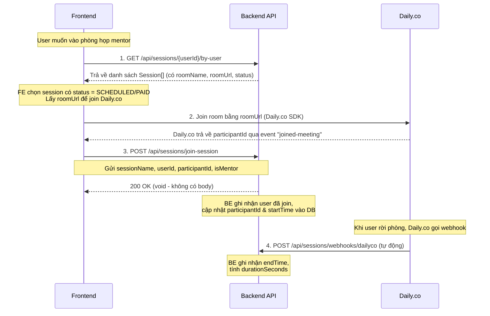
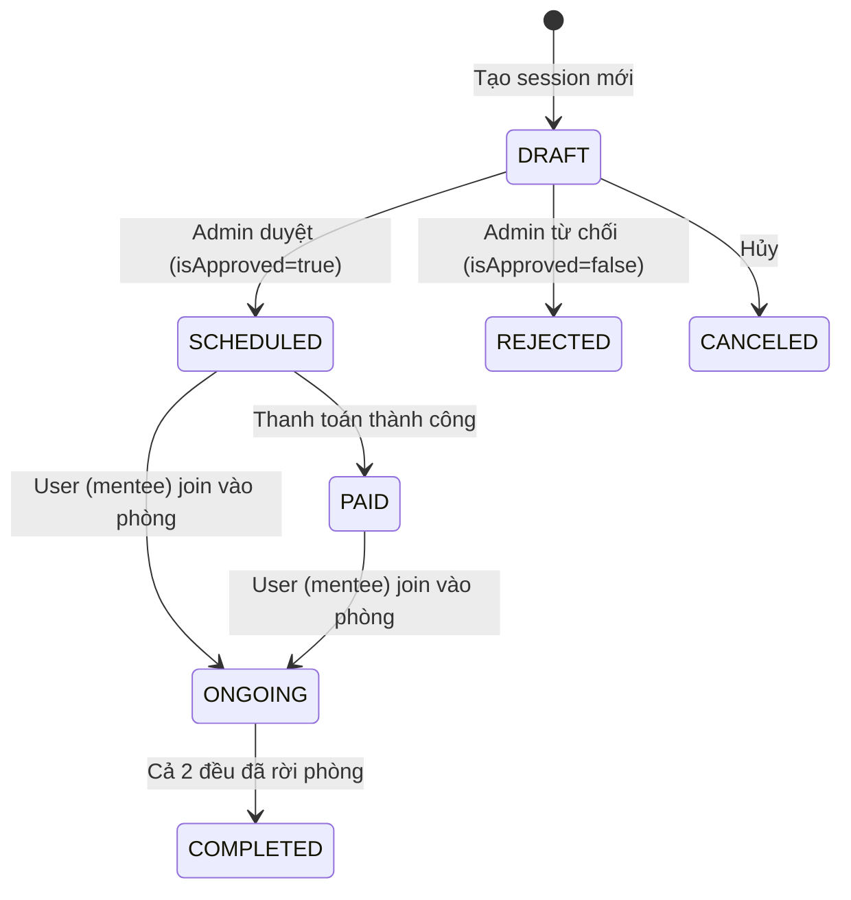
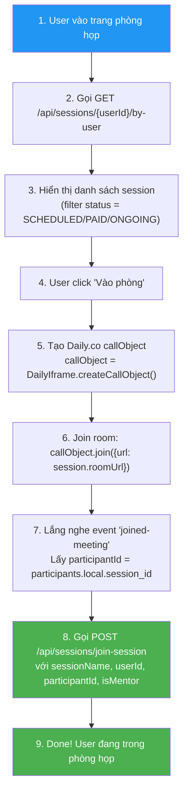

# 📋 Hướng Dẫn Tích Hợp API Session & Daily.co Room (Dành cho FE)

> [!IMPORTANT]
> **Base URL Backend**: `{BASE_URL}/api/sessions`
> Tài liệu này mô tả chi tiết luồng join/tạo phòng họp Daily.co, endpoint, request/response để FE dev có thể implement 100%.

---

## 1. Tổng Quan Luồng (Flow Overview)



---

## 2. Session Entity Model (Cấu trúc dữ liệu Session)

> [!NOTE]
> Đây là object `Session` mà BE trả về. FE cần hiểu rõ các field để mapping UI.

| Field              | Type             | Mô tả                                                                                                       |
| ------------------ | ---------------- | ----------------------------------------------------------------------------------------------------------- |
| `id`               | `int`            | ID session (auto-generated)                                                                                 |
| `roomName`         | `string`         | Tên phòng Daily.co (ví dụ: `"session-1720000000000"`) — **đây chính là `sessionName` khi gọi join-session** |
| `roomUrl`          | `string`         | URL phòng Daily.co (ví dụ: `"https://inblue.daily.co/session-xxx"`) — **dùng để join room**                 |
| `userId`           | `int`            | ID của mentee (người dùng thường)                                                                           |
| `userId2`          | `int`            | ID của mentor                                                                                               |
| `participantId1`   | `string \| null` | Daily.co participant ID của mentee (FE gửi về sau khi join)                                                 |
| `participantId2`   | `string \| null` | Daily.co participant ID của mentor                                                                          |
| `startTime1`       | `string \| null` | Thời điểm mentee join (BE tự set)                                                                           |
| `startTime2`       | `string \| null` | Thời điểm mentor join (BE tự set)                                                                           |
| `endTime1`         | `string \| null` | Thời điểm mentee rời phòng (webhook tự set)                                                                 |
| `endTime2`         | `string \| null` | Thời điểm mentor rời phòng (webhook tự set)                                                                 |
| `durationSeconds1` | `number \| null` | Tổng thời gian mentee ở trong phòng (giây)                                                                  |
| `durationSeconds2` | `number \| null` | Tổng thời gian mentor ở trong phòng (giây)                                                                  |
| `joinTime`         | `string`         | Thời gian hẹn join (format: `"yyyy-MM-dd HH:mm:ss.SSS"`)                                                    |
| `recordUrl`        | `string \| null` | URL recording                                                                                               |
| `status`           | `string`         | Trạng thái session (xem bảng bên dưới)                                                                      |
| `duration`         | `int \| null`    | Thời lượng đặt (phút)                                                                                       |
| `totalPrice`       | `int \| null`    | Tổng giá tiền                                                                                               |
| `transactionCode`  | `string \| null` | Mã giao dịch thanh toán                                                                                     |
| `sessionKey`       | `string \| null` | Session key (dùng cho kiosk)                                                                                |
| `kioskId`          | `number \| null` | ID kiosk                                                                                                    |

### Session Status Lifecycle



| Status      | Ý nghĩa                             | FE có thể join?                |
| ----------- | ----------------------------------- | ------------------------------ |
| `DRAFT`     | Mới tạo, chưa duyệt                 | ❌ Không (BE sẽ throw lỗi 409) |
| `SCHEDULED` | Đã được admin duyệt                 | ✅ Có                          |
| `PAID`      | Đã thanh toán                       | ✅ Có                          |
| `REJECTED`  | Bị từ chối                          | ❌ Không                       |
| `ONGOING`   | Đang diễn ra (có người trong phòng) | ✅ Có                          |
| `COMPLETED` | Đã kết thúc                         | ❌ Không nên                   |
| `CANCELED`  | Đã hủy                              | ❌ Không                       |

---

## 3. Chi Tiết Các Endpoint

---

### 3.1. 🔍 Lấy danh sách Session của User

> **Mục đích**: Lấy tất cả session liên quan đến 1 user (cả vai trò mentee lẫn mentor) để hiển thị cho user chọn phòng nào để join.

```
GET /api/sessions/{userId}/by-user
```

**Path Parameters:**

| Parameter | Type  | Required | Mô tả                      |
| --------- | ----- | -------- | -------------------------- |
| `userId`  | `int` | ✅       | ID của user đang đăng nhập |

**Request**: Không có body

**Response**: `200 OK`

```json
[
  {
    "id": 15,
    "roomName": "session-1720000000000",
    "userId": 5,
    "participantId1": null,
    "startTime1": null,
    "endTime1": null,
    "durationSeconds1": null,
    "userId2": 3,
    "participantId2": null,
    "startTime2": null,
    "endTime2": null,
    "durationSeconds2": null,
    "roomUrl": "https://inblue.daily.co/session-1720000000000",
    "joinTime": "2026-07-12 14:00:00.000",
    "recordUrl": null,
    "status": "SCHEDULED",
    "duration": 60,
    "totalPrice": 200000,
    "transactionCode": null,
    "sessionKey": null,
    "kioskId": null
  }
]
```

**FE cần làm gì**:

1. Gọi endpoint này khi user vào trang "Danh sách phòng họp" hoặc "Lịch hẹn mentor"
2. Filter hiển thị các session có `status` là `SCHEDULED`, `PAID`, hoặc `ONGOING`
3. Từ mỗi session, lấy `roomUrl` để join Daily.co, lấy `roomName` để gửi khi gọi join-session

---

### 3.2. 🚪 Join Session (GHI NHẬN tham gia phòng)

> [!IMPORTANT]
> **Đây là endpoint chính mà Backend leader yêu cầu FE phải gọi.**
> Endpoint này KHÔNG phải để join phòng Daily.co, mà là gửi thông tin **sau khi FE đã join Daily.co thành công** để BE ghi nhận vào database.

```
POST /api/sessions/join-session
```

**Request Headers:**

```
Content-Type: application/json
```

**Request Body:**

| Field           | Type      | Required | Mô tả                                                                    |
| --------------- | --------- | -------- | ------------------------------------------------------------------------ |
| `sessionName`   | `string`  | ✅       | Chính là `roomName` từ object Session (ví dụ: `"session-1720000000000"`) |
| `userId`        | `int`     | ✅       | ID user đang join (mentee hoặc mentor)                                   |
| `participantId` | `string`  | ✅       | **Lấy từ Daily.co SDK** sau khi join meeting thành công (xem mục 4)      |
| `isMentor`      | `boolean` | ✅       | `true` nếu user là mentor, `false` nếu là mentee/ứng viên                |

```json
{
  "sessionName": "session-1720000000000",
  "userId": 5,
  "participantId": "d61cd7b2-a273-42b4-90c5-deadbeef1234",
  "isMentor": false
}
```

**Response Thành Công**: `200 OK` (không có response body)

**Response Lỗi:**

| HTTP Code | Khi nào                                                                    | Error Message                                                                |
| --------- | -------------------------------------------------------------------------- | ---------------------------------------------------------------------------- |
| `404`     | `sessionName` không tồn tại trong DB                                       | `"Không tìm thấy phòng họp !!"`                                              |
| `409`     | Session đang ở trạng thái `DRAFT` (chưa duyệt)                             | `"Phòng họp chưa được duyệt"`                                                |
| `403`     | `userId` không khớp với session (mentee gửi ID sai hoặc mentor gửi ID sai) | `"User ID không khớp với Session"` hoặc `"Mentor ID không khớp với Session"` |

**Business Logic bên BE khi nhận request này:**

- Nếu `isMentor = false` (mentee):
  - Kiểm tra `userId` == `session.userId` → nếu khớp thì lưu `participantId` vào `participantId1`, set `startTime1`, set `status = ONGOING`
- Nếu `isMentor = true` (mentor):
  - Kiểm tra `userId` == `session.userId2` → nếu khớp thì lưu `participantId` vào `participantId2`, set `startTime2`

> [!WARNING]
> **Lưu ý JSON field name**: Trong Java, field tên `isMentor` (boolean) khi serialize bởi Jackson sẽ thành `"mentor"` (bỏ prefix "is"). Nếu BE dùng `@Data` (Lombok) thì getter là `isMentor()` → Jackson serialize thành `"mentor"`.
>
> **Thử cả 2**: Nếu gửi `"isMentor": false` mà BE không nhận đúng → thử đổi thành `"mentor": false`.

---

### 3.3. 📋 Lấy Session theo ID

```
GET /api/sessions/{id}
```

**Path Parameters:**

| Parameter | Type  | Required | Mô tả                  |
| --------- | ----- | -------- | ---------------------- |
| `id`      | `int` | ✅       | ID của session cần lấy |

**Response**: `200 OK` — trả về 1 object `Session` (cấu trúc giống mục 2)

**Lỗi**: `404` nếu không tìm thấy

---

### 3.4. ➕ Tạo Session Mới (Tham khảo)

> [!NOTE]
> Endpoint này dùng để **tạo phòng họp mới** với mentor. FE gọi khi user đặt lịch hẹn mentor.

```
POST /api/sessions/create-session
```

**Request Body:**

```json
{
  "dailyCoCreationRequest": {
    "name": "",
    "privacy": "public",
    "properties": {
      "max_participants": 2,
      "start_video_off": true,
      "start_audio_off": true,
      "enable_screenshare": true,
      "exp": 120,
      "enable_recording": "cloud"
    }
  },
  "userId": 5,
  "mentorId": 3,
  "joinTime": "2026-07-12T14:00:00.000+07:00",
  "duration": 60,
  "totalPrice": 200000
}
```

> **Lưu ý**: `name` để rỗng (BE tự generate), `privacy` luôn = `"public"`, `enable_recording` luôn = `"cloud"` — FE không cần cho user chọn các field này.

**Response**: `200 OK`

```json
{
  "id": "abc123xyz",
  "name": "session-1720000000000",
  "url": "https://inblue.daily.co/session-1720000000000",
  "api_created": true,
  "created_at": "2026-07-11T10:00:00.000Z",
  "config": {
    "nbf": null,
    "exp": 1720003600
  }
}
```

---

### 3.5. ✅ Cập nhật trạng thái Session (Admin)

```
GET /api/sessions/update-status?sessionId={id}&isApproved={true|false}
```

**Query Parameters:**

| Parameter    | Type      | Mô tả                                  |
| ------------ | --------- | -------------------------------------- |
| `sessionId`  | `int`     | ID session                             |
| `isApproved` | `boolean` | `true` → SCHEDULED, `false` → REJECTED |

---

### 3.6. 💳 Thanh toán Session

```
GET /api/sessions/make-payment?sessionId={id}
```

**Response**: `200 OK` — trả về `string` (URL thanh toán PayOS)

---

## 4. 🔑 Cách Lấy `participantId` từ Daily.co SDK (Quan trọng nhất cho FE)

> [!CAUTION]
> **Đây là phần Backend leader nhắn "có code á, m coi cái code join room cũ để lấy participantId".**
> FE phải lấy `participantId` từ Daily.co SDK, KHÔNG phải từ backend.

### Bước 1: Install Daily.co SDK

```bash
npm install @daily-co/daily-js
```

### Bước 2: Tạo Daily.co call object và join room

```typescript
import DailyIframe from "@daily-co/daily-js";

// Tạo call object
const callObject = DailyIframe.createCallObject();

// Join room bằng roomUrl lấy từ Session
await callObject.join({ url: session.roomUrl });
```

### Bước 3: Lấy participantId sau khi join thành công

```typescript
// Cách 1: Lắng nghe event "joined-meeting"
callObject.on("joined-meeting", (event) => {
  const localParticipant = event?.participants?.local;
  const participantId = localParticipant?.session_id; // ← ĐÂY LÀ participantId

  console.log("participantId:", participantId);

  // Gọi API join-session ngay sau khi có participantId
  joinSessionAPI({
    sessionName: session.roomName, // roomName từ Session object
    userId: currentUser.id, // ID user đang đăng nhập
    participantId: participantId, // session_id từ Daily.co
    isMentor: currentUser.role === "MENTOR", // true nếu user là mentor
  });
});

// Cách 2: Lấy từ participants() sau khi đã join
const participants = callObject.participants();
const participantId = participants.local.session_id;
```

> [!TIP]
> **`participantId`** trong backend chính là **`session_id`** trong Daily.co SDK (thuộc tính của participant object). Đừng nhầm với session ID của hệ thống Inblue.

### Bước 4: Gọi API join-session

```typescript
// Hàm gọi API join-session
async function joinSessionAPI(data: {
  sessionName: string;
  userId: number;
  participantId: string;
  isMentor: boolean;
}) {
  try {
    const response = await fetch(`${BASE_URL}/api/sessions/join-session`, {
      method: "POST",
      headers: { "Content-Type": "application/json" },
      body: JSON.stringify(data),
    });

    if (!response.ok) {
      const error = await response.json();
      console.error("Join session failed:", error);
      // Handle error (hiển thị toast/notification)
    }
  } catch (err) {
    console.error("Network error:", err);
  }
}
```

---

## 5. 📝 Tổng Kết: FE Cần Làm Gì (Step-by-Step)



### Checklist cho FE Developer:

- [ ] Gọi `GET /api/sessions/{userId}/by-user` để lấy danh sách session
- [ ] Filter và hiển thị các session có status hợp lệ (`SCHEDULED`, `PAID`, `ONGOING`)
- [ ] Xác định user hiện tại là mentee hay mentor (so sánh `currentUser.id` với `session.userId` vs `session.userId2`)
- [ ] Dùng `roomUrl` từ Session để join Daily.co
- [ ] Sau khi join thành công, lấy `session_id` (participantId) từ Daily.co SDK
- [ ] Gọi `POST /api/sessions/join-session` với đầy đủ 4 field
- [ ] Handle error cases (404, 409, 403)
- [ ] **Không cần** handle webhook `participant.left` — Daily.co tự gọi qua webhook đến BE

### Xác định `isMentor`:

```typescript
// Cách xác định isMentor dựa trên Session object:
const isMentor = currentUser.id === session.userId2; // userId2 = mentor
const isMentee = currentUser.id === session.userId; // userId  = mentee
```

---

## 6. Tham Chiếu File Backend

| File                 | Đường dẫn                                                                   |
| -------------------- | --------------------------------------------------------------------------- |
| Controller           | `src/main/java/fpt/org/inblue/controller/SessionController.java`            |
| Service Interface    | `src/main/java/fpt/org/inblue/service/SessionService.java`                  |
| Service Impl         | `src/main/java/fpt/org/inblue/service/impl/SessionServiceImpl.java`         |
| Entity Model         | `src/main/java/fpt/org/inblue/model/Session.java`                           |
| Join Request DTO     | `src/main/java/fpt/org/inblue/model/dto/request/JoinSessionDtoRequest.java` |
| Session Response DTO | `src/main/java/fpt/org/inblue/model/dto/dailyco/SessionResponse.java`       |
| Session Status Enum  | `src/main/java/fpt/org/inblue/enums/SessionStatus.java`                     |
| Webhook Payload      | `src/main/java/fpt/org/inblue/model/dto/dailyco/DailyWebHookPayload.java`   |
| Repository           | `src/main/java/fpt/org/inblue/repository/SessionRepository.java`            |
