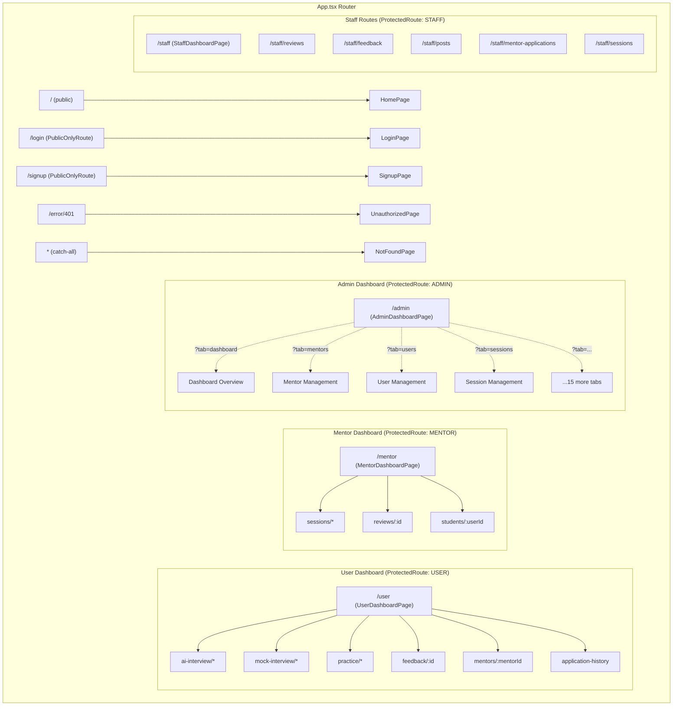

# 04 — Routing System

> **Library:** `react-router-dom` v7.10.0  
> **Entry:** `src/App.tsx`  
> **Last Synced:** 2026-06-05

---

## 1. Router Architecture

The entire routing configuration lives in a single `App.tsx` file using React Router v7's declarative `<Routes>` and `<Route>` components.

### Provider Tree

```tsx
<ErrorBoundary>
  <QueryProvider>
    <Toaster /> {/* Sonner toast */}
    <BrowserRouter>
      {" "}
      {/* HTML5 History API */}
      <SessionExpiryGuard /> {/* JWT polling (renders nothing) */}
      <PublicScrollToTopButton /> {/* Floating scroll button */}
      <Routes>{/* All route definitions */}</Routes>
    </BrowserRouter>
  </QueryProvider>
</ErrorBoundary>
```

---

## 2. Complete Route Map

### 2.1 — Public Routes (No Auth Required)

| Path               | Component                    | Notes                   |
| ------------------ | ---------------------------- | ----------------------- |
| `/`                | `HomePage`                   | Landing page            |
| `/payment/success` | `PaymentSuccessPage`         | Payment callback        |
| `/payment/cancel`  | `PaymentCancelPage`          | Payment callback        |
| `/success`         | `PaymentSuccessPage`         | Legacy alias            |
| `/cancel`          | `PaymentCancelPage`          | Legacy alias            |
| `/auth/callback`   | `QueryHashRedirect → /login` | OAuth callback redirect |
| `/oauth2/callback` | `QueryHashRedirect → /login` | OAuth callback redirect |

### 2.2 — Public Content Routes

| Path                         | Component                    | Section    |
| ---------------------------- | ---------------------------- | ---------- |
| `/questions/bank`            | `QuestionBankPage`           | Questions  |
| `/questions/tips`            | `InterviewTipsPage`          | Questions  |
| `/enterprise/companies`      | `CompanySearchPage`          | Enterprise |
| `/enterprise/company/:id`    | `CompanyDetailPage`          | Enterprise |
| `/enterprise/job/:id`        | `JobDescriptionDetailPage`   | Enterprise |
| `/features/ai-interview`     | `AIInterviewFeaturePage`     | Features   |
| `/features/mentor-interview` | `MentorInterviewFeaturePage` | Features   |
| `/resources/faq`             | `FAQPage`                    | Resources  |
| `/resources/blog`            | `BlogPage`                   | Resources  |

### 2.3 — Dev-Only Routes

| Path              | Component        | Guard                 |
| ----------------- | ---------------- | --------------------- |
| `/dev/playground` | `PlaygroundPage` | `import.meta.env.DEV` |

### 2.4 — Auth Routes (PublicOnlyRoute)

| Path               | Component                 | Layout       |
| ------------------ | ------------------------- | ------------ |
| `/login`           | `LoginPage`               | `AuthLayout` |
| `/signup`          | `SignupPage`              | `AuthLayout` |
| `/select-role`     | `SelectRolePage`          | Full page    |
| `/mentor-register` | `MentorRegisterPage`      | Full page    |
| `/waiting-accept`  | `WaitingAcceptMentorPage` | Full page    |

### 2.5 — User Dashboard Routes (`/user/*`)

Guard: `ProtectedRoute allowedRoles={["USER"]}`  
Shell: `UserDashboardPage` (ChromeTabs + `<Outlet />`)

| Nested Path                                                      | Component                       |
| ---------------------------------------------------------------- | ------------------------------- |
| `ai-interview/setup`                                             | `AIInterviewSetupPage`          |
| `ai-interview/session`                                           | `AIInterviewSessionPage`        |
| `ai-interview/result/:id`                                        | `AIInterviewResultPage`         |
| `mock-interview/select-mentor`                                   | `MockInterviewSelectMentorPage` |
| `mock-interview/schedule`                                        | `MockInterviewSchedulePage`     |
| `mock-interview/booking-success`                                 | `BookingSuccessPage`            |
| `mock-interview/room/:sessionId`                                 | `SessionRoomPage`               |
| `mock-interview/history/:sessionId/feedback`                     | `WriteReviewPage`               |
| `mock-interview/history/:sessionId`                              | `SessionDetailPage`             |
| `practice/session/:sessionId/:practiceSetId/quiz/:quizId/result` | `QuizResultPage`                |
| `practice/session/:sessionId/:practiceSetId/quiz/:quizId`        | `QuizPage`                      |
| `practice/session/:sessionId`                                    | `PracticeSetDetailPage`         |
| `practice/:id`                                                   | `PracticeSetDetailPage`         |
| `feedback/:id`                                                   | `FeedbackDetailPage`            |
| `mentors/:mentorId`                                              | `MentorDetailPage`              |
| `application-history`                                            | `ApplicationHistoryPage`        |

### 2.6 — Mentor Dashboard Routes (`/mentor/*`)

Guard: `ProtectedRoute allowedRoles={["MENTOR"]}`  
Shell: `MentorDashboardPage` (ChromeTabs + `<Outlet />`)

| Nested Path                  | Component                 |
| ---------------------------- | ------------------------- |
| `sessions/:sessionId`        | `MentorSessionDetailPage` |
| `sessions/room/:sessionId`   | `MentorSessionRoomPage`   |
| `sessions/:sessionId/review` | `WriteFeedbackPage`       |
| `reviews/:id`                | `ReviewDetailPage`        |
| `students/:userId`           | `StudentDetailPage`       |

### 2.7 — Admin Routes (`/admin`)

Guard: `ProtectedRoute allowedRoles={["ADMIN"]}`  
Shell: `AdminDashboardPage` (ChromeTabs + built-in Sidebar)

| Path                          | Component            | Notes                            |
| ----------------------------- | -------------------- | -------------------------------- |
| `/admin`                      | `AdminDashboardPage` | Default tab rendered via `?tab=` |
| `/admin/companies/:companyId` | `AdminDashboardPage` | Deep link into company detail    |

**Admin tabs** (switched via `?tab=` query param, NOT separate routes):

| Tab Key              | Description                    |
| -------------------- | ------------------------------ |
| `dashboard`          | Dashboard overview with charts |
| `mentors`            | Mentor management              |
| `users`              | User management                |
| `sessions`           | Session management             |
| `reviews`            | Review management              |
| `feedback`           | Feedback management            |
| `notifications`      | Notification management        |
| `questionCategories` | Question category CRUD         |
| `questionMajors`     | Question major CRUD            |
| `practiceSets`       | Practice set management        |
| `practiceQuestions`  | Practice question management   |
| `quizSets`           | Quiz set management            |
| `posts`              | Post moderation                |
| `companies`          | Company management             |
| `candidateProfiles`  | Candidate profile management   |
| `featureUsageLogs`   | Feature usage analytics        |
| `payments`           | Payment management             |

### 2.8 — Staff Routes (`/staff/*`)

Guard: `ProtectedRoute allowedRoles={["STAFF"]}`  
**No shared shell** — each page is a standalone route.

| Path                         | Component                |
| ---------------------------- | ------------------------ |
| `/staff`                     | `StaffDashboardPage`     |
| `/staff/reviews`             | `ReviewModerationPage`   |
| `/staff/feedback`            | `FeedbackModerationPage` |
| `/staff/posts`               | `PostModerationPage`     |
| `/staff/mentor-applications` | `MentorApplicationsPage` |
| `/staff/sessions`            | `SessionProcessingPage`  |

### 2.9 — Error Routes

| Path         | Component                  |
| ------------ | -------------------------- |
| `/error/401` | `UnauthorizedPage`         |
| `/error/403` | `ForbiddenPage`            |
| `/error/404` | `NotFoundPage`             |
| `/error/500` | `ServerErrorPage`          |
| `/error/503` | `ServiceUnavailablePage`   |
| `/error/504` | `GatewayTimeoutPage`       |
| `*`          | `NotFoundPage` (catch-all) |

### 2.10 — Backward-Compatibility Redirects

Many legacy routes redirect to the new structure:

| Old Path                          | Redirects To                                |
| --------------------------------- | ------------------------------------------- |
| `/dashboard`                      | `/user`                                     |
| `/dashboard/mock-interview`       | `/user?tab=mockInterview`                   |
| `/dashboard/feedback`             | `/user?tab=feedback`                        |
| `/dashboard/ai-interview`         | `/user?tab=aiInterview`                     |
| `/dashboard/practice`             | `/user?tab=practice`                        |
| `/dashboard/notifications`        | `/user?tab=notifications`                   |
| `/dashboard/account`              | `/user?tab=account`                         |
| `/dashboard/ai-interview/*`       | `/user/ai-interview/*` (preserves suffix)   |
| `/dashboard/mock-interview/*`     | `/user/mock-interview/*` (preserves suffix) |
| `/dashboard/practice/*`           | `/user/practice/*` (preserves suffix)       |
| `/dashboard/feedback/*`           | `/user/feedback/*` (preserves suffix)       |
| `/mentor-dashboard`               | `/mentor`                                   |
| `/mentor-dashboard/homefeed`      | `/mentor?tab=homeFeed`                      |
| `/mentor-dashboard/overview`      | `/mentor?tab=overview`                      |
| `/mentor-dashboard/sessions`      | `/mentor?tab=sessions`                      |
| `/mentor-dashboard/students`      | `/mentor?tab=students`                      |
| `/mentor-dashboard/reviews`       | `/mentor?tab=reviews`                       |
| `/mentor-dashboard/feedback`      | `/mentor?tab=feedback`                      |
| `/mentor-dashboard/notifications` | `/mentor?tab=notifications`                 |
| `/mentor-dashboard/account`       | `/mentor?tab=account`                       |
| `/admin/dashboard`                | `/admin?tab=dashboard`                      |
| `/admin/mentors`                  | `/admin?tab=mentors`                        |
| `/admin/users`                    | `/admin?tab=users`                          |
| `/admin/sessions`                 | `/admin?tab=sessions`                       |
| `/admin/reviews`                  | `/admin?tab=reviews`                        |
| `/admin/feedback`                 | `/admin?tab=feedback`                       |
| `/admin/notifications`            | `/admin?tab=notifications`                  |
| `/admin/questionCategories`       | `/admin?tab=questionCategories`             |
| `/admin/questionMajors`           | `/admin?tab=questionMajors`                 |
| `/admin/practiceSets`             | `/admin?tab=practiceSets`                   |
| `/admin/questionSets`             | `/admin?tab=practiceSets`                   |
| `/admin/practiceQuestions`        | `/admin?tab=practiceQuestions`              |
| `/admin/quizSets`                 | `/admin?tab=quizSets`                       |
| `/admin/posts`                    | `/admin?tab=posts`                          |
| `/admin/companies`                | `/admin?tab=companies`                      |
| `/admin/candidateProfiles`        | `/admin?tab=candidateProfiles`              |

---

## 3. Route Guards

### 3.1 — `ProtectedRoute`

```typescript
function ProtectedRoute({ allowedRoles }: ProtectedRouteProps) {
  const { isLoggedIn, isLoading, user } = useAuthStore();

  // 1. Show spinner while Zustand rehydrates from localStorage
  if (isLoading) {
    return <SpinnerBlock fullScreen size="xl" />;
  }

  // 2. Redirect to login if not authenticated
  if (!isLoggedIn) {
    return <Navigate to="/login" replace />;
  }

  // 3. Redirect to 403 if role not in allowedRoles
  if (allowedRoles && user?.role && !allowedRoles.includes(user.role)) {
    return <Navigate to="/error/403" replace />;
  }

  // 4. Render child routes
  return <Outlet />;
}
```

### 3.2 — `PublicOnlyRoute`

```typescript
function PublicOnlyRoute() {
  const { isLoggedIn, isLoading, user } = useAuthStore();

  if (isLoading) {
    return <SpinnerBlock fullScreen size="xl" />;
  }

  // Redirect logged-in users to their role-based dashboard
  if (isLoggedIn) {
    return <Navigate to={getDashboardPath(user?.role)} replace />;
  }

  return <Outlet />;
}
```

### 3.3 — `SessionExpiryGuard`

A **render-less component** that monitors JWT expiry:

```typescript
function SessionExpiryGuard() {
  // Check on mount
  useEffect(() => {
    enforceSessionExpiry();
  }, [enforceSessionExpiry]);

  // Check every 30 seconds
  useEffect(() => {
    if (!isLoggedIn) return;
    const timerId = setInterval(enforceSessionExpiry, 30000);
    return () => clearInterval(timerId);
  }, [enforceSessionExpiry, isLoggedIn]);

  // Check on visibility change (tab focus) and window focus
  useEffect(() => {
    document.addEventListener("visibilitychange", handleVisibilityChange);
    window.addEventListener("focus", handleFocus);
    return () => {
      document.removeEventListener("visibilitychange", handleVisibilityChange);
      window.removeEventListener("focus", handleFocus);
    };
  }, [enforceSessionExpiry]);

  return null; // Renders nothing
}
```

---

## 4. Route Hierarchy Diagram



---

## 5. Tab State Management

The `useTabsState` hook manages Chrome-style tabs with URL synchronization and localStorage persistence:

### 5.1 — Interface

```typescript
interface UseTabsStateOptions {
  storageKey: string; // → localStorage key: "tabs_state_{storageKey}"
  defaultTab: string; // Fallback tab when URL param is missing/invalid
  availableTabs: Array<{ type: string; label: string }>; // Valid tab definitions
}

interface UseTabsStateReturn {
  activeTab: string; // Currently active tab type (from URL)
  openTabs: Tab[]; // All open tabs (persisted)
  setActiveTab: (tabType: string) => void; // Switch active tab
  openTab: (tabType: string) => void; // Open new tab or switch to existing
  closeTab: (tabId: string) => void; // Close tab by ID
  resetTabsTo: (tabType: string) => void; // Reset to single tab
}
```

### 5.2 — URL + localStorage Synchronization

The hook maintains **two synchronized sources of truth**:

| Source                          | What it stores                   | Sync direction                       |
| ------------------------------- | -------------------------------- | ------------------------------------ |
| URL `?tab=` param               | Active tab type                  | Read on mount, write on tab change   |
| localStorage `tabs_state_{key}` | Open tabs list + last active tab | Read on mount, write on every change |

**Initialization flow:**

1. Read `?tab=` from URL → validate against `availableTabs` → fallback to `defaultTab`
2. Read `tabs_state_{key}` from localStorage → filter to only valid tab types
3. Ensure the URL-active tab exists in the open tabs list → add if missing
4. If no valid saved tabs → create single default tab

**Validation:** Invalid tab types (e.g., `?tab=nonexistent`) are silently replaced with `defaultTab` — no error is thrown.

### 5.3 — Close Tab Behavior

The `closeTab` function uses a **`pendingActiveTabRef`** pattern to handle the synchronization between tab closure and URL update:

```typescript
const closeTab = useCallback(
  (tabId: string) => {
    setOpenTabs((prev) => {
      const filtered = prev.filter((tab) => tab.id !== tabId);
      if (filtered.length === 0) {
        // Never close the last tab — reset to default instead
        const defaultTabConfig = availableTabs.find((t) => t.type === defaultTab);
        return defaultTabConfig
          ? [{ id: generateTabId(defaultTab), type: defaultTab, label: defaultTabConfig.label }]
          : prev;
      }

      // If closing the active tab, schedule a URL update to the last remaining tab
      const closedTab = prev.find((tab) => tab.id === tabId);
      if (closedTab?.type === activeTab) {
        pendingActiveTabRef.current = filtered[filtered.length - 1].type;
      }

      return filtered;
    });
  },
  [activeTab, availableTabs, defaultTab]
);
```

**Key behaviors:**

- **Never closes last tab**: If all tabs are closed, it resets to the default tab
- **Deferred URL update**: The `pendingActiveTabRef` pattern avoids React state update batching issues — the URL update happens in a `useEffect` after the tab state is committed
- **Active tab tracking**: If the closed tab was active, the URL is updated to the last remaining tab

### 5.4 — Complete Usage Example

```typescript
const { activeTab, openTabs, setActiveTab, openTab, closeTab, resetTabsTo } = useTabsState({
  storageKey: "admin", // localStorage key: "tabs_state_admin"
  defaultTab: "dashboard", // Fallback when no ?tab= param
  availableTabs: [
    { type: "dashboard", label: "Dashboard" },
    { type: "users", label: "Users" },
    { type: "mentors", label: "Mentors" },
    { type: "sessions", label: "Sessions" },
    // ... 13 more tabs
  ],
});

// URL: /admin?tab=dashboard → activeTab = "dashboard"
// localStorage: { tabs: [...openTabs], lastActiveTab: "dashboard", version: 1 }
```

---

## 6. Deployment Routing (Vercel)

```json
// vercel.json
{
  "rewrites": [
    {
      "source": "/(.*)",
      "destination": "/index.html"
    }
  ]
}
```

**How it works:** The single rewrite rule sends **every URL** to `index.html`. React Router then takes over client-side:

| URL accessed                 | Vercel behavior     | React Router behavior                           |
| ---------------------------- | ------------------- | ----------------------------------------------- |
| `/user?tab=overview`         | Serves `index.html` | Matches `ProtectedRoute` → `UserDashboardPage`  |
| `/admin?tab=mentors`         | Serves `index.html` | Matches `ProtectedRoute` → `AdminDashboardPage` |
| `/login`                     | Serves `index.html` | Matches `PublicOnlyRoute` → `LoginPage`         |
| `/user/ai-interview/session` | Serves `index.html` | Matches nested route → `AIInterviewSessionPage` |
| `/nonexistent`               | Serves `index.html` | Catch-all `*` → `NotFoundPage`                  |

**Why this pattern:** SPA client-side routing requires the server to always return the app shell. Without this rewrite, direct URL access (or page refresh on a nested route) would return a 404 from Vercel's static file server.

**Vercel deployment is triggered** on every push to the main branch via the Vercel GitHub Integration. The `nx.json` and `project.json` files provide Nx task caching for builds.

---

_Document generated from source code analysis on 2026-06-05._
