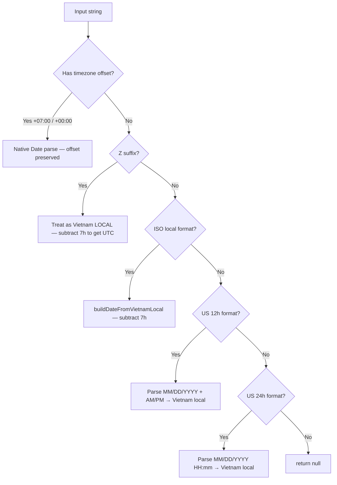
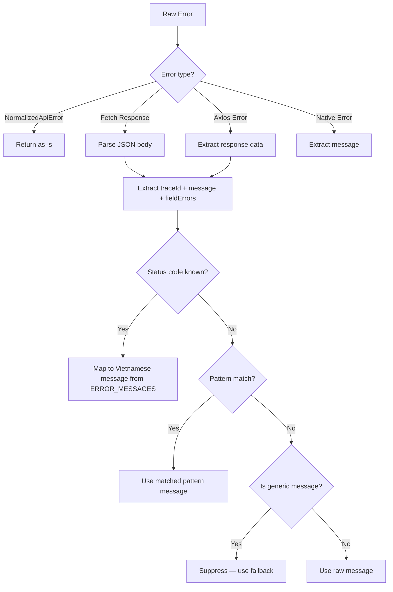
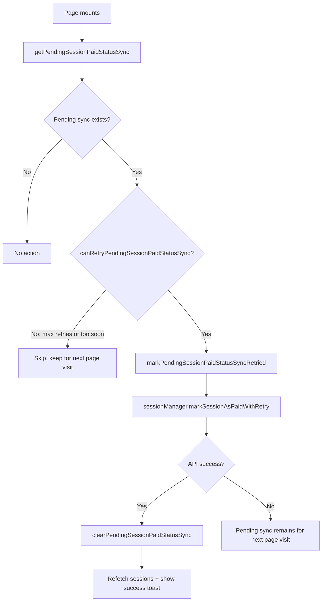
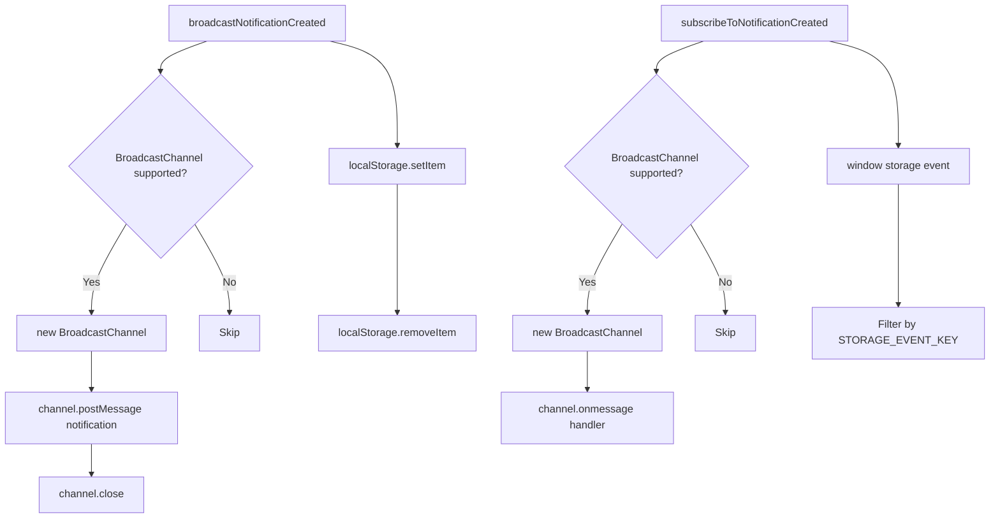

# Utility Functions & Helpers

> **Source:** `src/lib/`, `src/constants/`, `src/interfaces/`  
> **Last Synced:** 2026-06-05

---

## 1. Barrel Export (`src/lib/index.ts`)

```typescript
export * from "./api";
export * from "./error-normalizer";
export * from "./payment-callback";
export * from "./payment-recovery";
export * from "./session-paid-status-sync";
export * from "./session-payment-context";
export * from "./transforms";
export * from "./utils";
```

---

## 2. Core Utilities (`src/lib/utils.ts`)

### `cn()` — Class Name Merger

```typescript
import { clsx, type ClassValue } from "clsx";
import { twMerge } from "tailwind-merge";

export function cn(...inputs: ClassValue[]) {
  return twMerge(clsx(inputs));
}
```

Combines conditional class merging (clsx) with Tailwind conflict resolution (tailwind-merge).

### `extractDataArray()` — API Response Extractor

```typescript
export function extractDataArray<T>(response: ApiResponse<PaginatedResponse<T> | T[]>): T[];
```

Handles two backend response shapes: direct array or paginated `{ data: T[] }`.

### `formatToVietnamISOString()` — Timezone-Safe Date Formatting

```typescript
export function formatToVietnamISOString(date: Date): string;
// Returns: "2026-02-24T10:30:00" (Vietnam timezone, no offset suffix)
```

Uses `Intl.DateTimeFormat` with `sv-SE` locale (ISO-like output) and `Asia/Ho_Chi_Minh` timezone.

### `datetimeLocalToVietnamISOString()` — Input Value Normalizer

```typescript
export function datetimeLocalToVietnamISOString(value: string): string;
// Input: "2026-02-24T10:30" or "2026-02-24T10:30:00+07:00"
// Output: "2026-02-24T10:30:00"
```

Strips timezone offsets from `<input type="datetime-local">` values.

---

## 3. Formatting Library (`src/lib/formatting.ts`)

The most complex utility module — handles multi-format date parsing and locale-aware formatting.

### Date Formatting Functions

| Function                           | Output                                            | Example                 |
| ---------------------------------- | ------------------------------------------------- | ----------------------- |
| `formatDate(value)`                | DD/MM/YYYY (vi) or MM/DD/YYYY (en)                | `24/02/2026`            |
| `formatDateTime(value)`            | DD/MM/YYYY HH:mm                                  | `24/02/2026 10:30`      |
| `formatDateTimeWithSeconds(value)` | DD/MM/YYYY HH:mm:ss                               | `24/02/2026 10:30:15`   |
| `formatUtcNaiveDateTime(value)`    | Same as formatDateTime but uses UTC naive parsing | `24/02/2026 10:30`      |
| `formatTime(value)`                | HH:mm                                             | `10:30`                 |
| `formatRelativeTime(value)`        | "3 phút trước" / "3 minutes ago"                  | Relative                |
| `formatCurrency(value)`            | ₫1,234,567                                        | VND format              |
| `formatFileSize(bytes)`            | "1.5 MB"                                          | Human-readable          |
| `parseBackendDate(value)`          | `Date \| null`                                    | Multi-format parser     |
| `parseUtcNaiveDate(value)`         | `Date \| null`                                    | Treats ISO local as UTC |
| `toTimestamp(value)`               | `number \| null`                                  | Epoch ms                |
| `toUtcNaiveTimestamp(value)`       | `number \| null`                                  | Epoch ms (UTC naive)    |
| `toVietnamDateKey(value)`          | `string \| null`                                  | "2026-02-24"            |
| `treatZuluAsVietnamLocal(value)`   | `DateInput`                                       | Strips Z suffix         |

### Two Parsing Modes

The module provides two parallel parsing strategies:

1. **`parseBackendDate()`** — Treats ISO local strings (without offset) as **Vietnam local time**, subtracting 7 hours to get UTC. This is the default for most formatting functions.

2. **`parseUtcNaiveDate()`** — Treats ISO local strings as **UTC time** directly. Used when the backend sends UTC timestamps without the `Z` or `+00:00` suffix.

```typescript
// "2026-02-24T10:30:00" with parseBackendDate → 03:30 UTC (Vietnam local → UTC)
// "2026-02-24T10:30:00" with parseUtcNaiveDate → 10:30 UTC (treated as-is)
```

### Date Parsing Strategy

The parser uses a chain of regex patterns to handle multiple date formats from the backend:

| Regex Pattern             | Format Example              | Parsing Strategy            |
| ------------------------- | --------------------------- | --------------------------- |
| `ISO_WITH_OFFSET_PATTERN` | `2026-02-24T10:30:00+07:00` | Native `Date` constructor   |
| `ISO_ZULU_LOCAL_PATTERN`  | `2026-02-24T10:30:00Z`      | Treat as Vietnam local time |
| `ISO_LOCAL_PATTERN`       | `2026-02-24T10:30:00`       | Vietnam local → UTC offset  |
| `US_12H_PATTERN`          | `02/24/2026, 10:30 AM`      | Parse AM/PM → 24h → Vietnam |
| `US_24H_PATTERN`          | `02/24/2026, 10:30`         | Parse → Vietnam local → UTC |



**Critical detail**: The `Z` suffix is treated as **Vietnam local time** (not UTC) because the Spring Boot backend sometimes sends `Z` when it means local time. This is handled by `tryParseIsoLocalAsUtc()` which constructs a UTC date from what is actually a local timestamp.

### Cached `Intl.DateTimeFormat` Instances

The module caches `Intl.DateTimeFormat` instances to avoid repeated construction:

```typescript
let _dateFormatter: Intl.DateTimeFormat | null = null;
let _dateFormatterLocale = "";

function getDateFormatter(): Intl.DateTimeFormat {
  const locale = i18n.language === "en" ? "en-US" : "vi-VN";
  if (!_dateFormatter || _dateFormatterLocale !== locale) {
    _dateFormatter = new Intl.DateTimeFormat(locale, {
      timeZone: "Asia/Ho_Chi_Minh",
      day: "2-digit",
      month: "2-digit",
      year: "numeric",
    });
    _dateFormatterLocale = locale;
  }
  return _dateFormatter;
}
```

Four separate cached formatters exist: `date`, `dateTime`, `dateTimeSec`, and `time`. Each is invalidated when the locale changes.

### Currency Formatting

```typescript
formatCurrency(amount);
// Vietnamese locale: "1.234.567 ₫"
// English locale: "1,234,567 ₫"
```

Uses `Intl.NumberFormat` with locale-aware grouping separators. The `₫` symbol is appended as a suffix.

---

## 4. Error Normalizer (`src/lib/error-normalizer.ts`)

Centralizes error handling for consistent user-facing messages.

### `normalizeApiError(error)` → `NormalizedApiError`

```typescript
interface NormalizedApiError {
  status?: number;
  message: string; // User-facing (Vietnamese)
  traceId?: string;
  rawMessage?: string; // Original error text
  source: "axios" | "fetch" | "native" | "unknown";
  fieldErrors?: Record<string, string>; // Per-field validation errors
  details?: unknown; // Raw payload
  payload?: unknown;
  code?: string; // Backend error code
}
```

### Convenience Functions

| Function                      | Purpose                                                                |
| ----------------------------- | ---------------------------------------------------------------------- |
| `getNormalizedErrorMessage()` | Returns just the `message` string (used by `useMutationHandler`)       |
| `toAppApiError()`             | Converts to `AppApiError` (extends `Error` with status, traceId, etc.) |

```typescript
// Simplified normalization — returns just the message string
export const getNormalizedErrorMessage = (error: unknown, fallbackMessage?: string): string => {
  return normalizeApiError(error, fallbackMessage).message;
};

// Full normalization — returns an Error subclass with all metadata
export const toAppApiError = (error: unknown, fallbackMessage?: string): AppApiError => {
  const normalized = normalizeApiError(error, fallbackMessage);
  const appError = new Error(normalized.message) as AppApiError;
  appError.status = normalized.status;
  appError.traceId = normalized.traceId;
  appError.source = normalized.source;
  appError.fieldErrors = normalized.fieldErrors;
  return appError;
};
```

### Error Resolution Pipeline



### Generic Message Suppression

The normalizer maintains a `GENERIC_MESSAGES` set that filters out uninformative backend messages:

```typescript
const GENERIC_MESSAGES = new Set([
  "internal server error",
  "request failed with status code 400",
  "request failed with status code 401",
  // ... all status code variants
  "network error",
]);
```

If the raw error message matches this set, it's treated as empty — falling back to the HTTP status code message or pattern match. This prevents showing users raw messages like "Request failed with status code 500".

### Stringified JSON Resilience (`parseMaybeJsonString`)

Some backend error responses send **stringified JSON** as the error payload (e.g., `"{\"message\":\"...\"}"`). The normalizer detects and parses these before processing:

```typescript
const parseMaybeJsonString = (value: string): unknown => {
  const trimmed = value.trim();
  if (!trimmed.startsWith("{") && !trimmed.startsWith("[")) {
    return value; // Not JSON-shaped — return as-is
  }
  try {
    return JSON.parse(trimmed) as unknown;
  } catch {
    return value; // Invalid JSON — return original string
  }
};
```

This is called inside `extractMessageFromPayload` when the payload is a string:

```typescript
if (typeof payload === "string") {
  const parsed = parseMaybeJsonString(payload);
  if (parsed !== payload) {
    return extractMessageFromPayload(parsed, depth + 1); // Re-process as parsed object
  }
  return asNonEmptyString(payload);
}
```

### Recursive Message Extraction

The `extractMessageFromPayload()` function traverses deep response structures (up to 4 levels) to find the most meaningful error message:

```typescript
const extractMessageFromPayload = (payload: unknown, depth = 0): string | undefined => {
  if (depth > 4) return undefined; // Prevent infinite recursion

  // String → try JSON.parse (some backends send stringified JSON)
  // Array → recurse into first item with a message
  // Object → check fields in priority order:
  //   message > error > detail > title > msg > reason > description
  //   → then recurse into payload.data (depth+1)
  //   → then extract from payload.errors (field errors, first value)
  //   → then extract from payload.fieldErrors (field errors, first value)
};
```

The field priority order is significant: `message` is checked first because Spring Boot's default error format uses it. `description` is last because it's an OAuth-specific field.

### Dual-Key TraceId Extraction

The `extractTraceId()` function checks **both** `traceId` and `traceID` (capital D) across the payload and error object, handling backend inconsistencies in casing:

```typescript
const extractTraceId = (error: unknown, payload: unknown): string | undefined => {
  // Check payload first (most common location)
  if (isRecord(payload)) {
    const payloadTraceId = asNonEmptyString(payload.traceId) || asNonEmptyString(payload.traceID);
    if (payloadTraceId) return payloadTraceId;
  }
  // Then check error.response.data (Axios-style)
  // Then check error directly
  return asNonEmptyString(error.traceId) || asNonEmptyString(error.traceID);
};
```

### Triple-Key Error Code Extraction

Similarly, `extractCode()` extracts application error codes from three possible field names:

```typescript
const extractCode = (error: unknown, payload: unknown): string | undefined => {
  if (isRecord(payload)) {
    const payloadCode =
      asNonEmptyString(payload.code) ||
      asNonEmptyString(payload.errorCode) || // camelCase
      asNonEmptyString(payload.error_code); // snake_case
    if (payloadCode) return payloadCode;
  }
  return asNonEmptyString(error.code);
};
```

### Multi-Path Status Extraction

`extractStatus()` probes the error object at multiple levels to find an HTTP status code:

```typescript
// Check order:
// 1. error.status / error.statusCode (direct property)
// 2. error.response.status / error.response.statusCode (Axios-style)
// 3. error.data.status / error.data.statusCode (nested data)
```

### Field Error Normalization

The `normalizeFieldErrors()` function handles Spring Boot validation error responses where fields may have single string messages or arrays of messages:

```typescript
// Single: { "email": "Email already exists" }
// Array: { "email": ["Email already exists", "Must be valid email"] }
// → Normalizes to: { "email": "Email already exists" } (first non-empty string)
```

### Status Code → Vietnamese Message Map

| Status | Message Key                                 |
| ------ | ------------------------------------------- |
| 400    | `general.invalidDataPleaseCheckAgain`       |
| 401    | `general.loginSessionExpiredPleaseLog`      |
| 403    | `general.youDoNotHavePermission`            |
| 404    | `general.requestedDataNotFound`             |
| 409    | `general.conflictingDataPleaseTryAgain`     |
| 413    | `general.fileIsTooLargePlease`              |
| 415    | `general.dataFormatNotSupported`            |
| 422    | `general.invalidDataPleaseCheckAgain`       |
| 429    | `general.tooManyRequestsPleaseTry`          |
| 500    | `general.theSystemIsExperiencingProblems`   |
| 502    | `general.theServerIsTemporarilyUnavailable` |
| 503    | `general.serviceIsUnderMaintenancePlease`   |
| 504    | `general.theServerRespondsTooSlowly`        |

### Known Error Patterns

| Pattern                                 | Vietnamese Message               |
| --------------------------------------- | -------------------------------- |
| `bad credentials / invalid password`    | "Mật khẩu không đúng"            |
| `user not found / not found with email` | "Email không tồn tại"            |
| `email already exists`                  | "Email đã tồn tại"               |
| `insufficient balance`                  | "Số dư ví không đủ"              |
| `no enum constant / json parse error`   | "Dữ liệu gửi không hợp lệ"       |
| `unsupported media type`                | "Định dạng dữ liệu không hỗ trợ" |
| `session not found`                     | "Không tìm thấy buổi phỏng vấn"  |
| `timeout`                               | "Yêu cầu đã hết thời gian chờ"   |

---

## 5. Transform Functions (`src/lib/transforms.ts`)

Converts between frontend form data shapes and backend API formats.

### User Transforms

| Function                       | Direction                      |
| ------------------------------ | ------------------------------ |
| `transformUserCreateRequest()` | Form → API create              |
| `transformUserUpdateRequest()` | Form → API update (with merge) |

### Session Transforms

| Function                          | Direction         |
| --------------------------------- | ----------------- |
| `transformSessionCreateRequest()` | Form → API create |
| `transformSessionUpdateRequest()` | Form → API update |

### Mentor Transforms

| Function                         | Direction         |
| -------------------------------- | ----------------- |
| `transformMentorCreateRequest()` | Form → API create |
| `transformMentorUpdateRequest()` | Form → API update |

All transforms normalize strings (trim), handle optional fields, and normalize major values via `normalizeMajor()`.

### Daily.co Room Configuration

`transformSessionCreateRequest` generates a full Daily.co room creation payload alongside user IDs:

```typescript
return {
  dailyCoCreationRequest: {
    name: formData.roomName || `session-${Date.now()}`,
    privacy: "private",
    properties: {
      max_participants: 2,
      start_video_off: false,
      start_audio_off: false,
      enable_screenshare: true,
      exp: 0, // Room does not auto-expire
      enable_recording: "cloud",
    },
  },
  userId: formData.userId,
  mentorId: formData.mentorId,
};
```

The room name defaults to `session-{timestamp}` if not provided. Recording is cloud-based, and the room is private with exactly 2 participants allowed.

### Validation Helpers

The module provides additional validation and normalization utilities:

| Function           | Purpose                                                         | Pattern                         |
| ------------------ | --------------------------------------------------------------- | ------------------------------- | ------------------------------------------ |
| `validateEmail()`  | Validates email format                                          | `/^[^\s@]+@[^\s@]+\.[^\s@]+$/`  |
| `validatePhone()`  | Validates Vietnamese phone numbers                              | `/^(0                           | \+84)\d{9,10}$/` (strips whitespace first) |
| `normalizePhone()` | Normalizes `+84` prefix to `0` prefix for consistent formatting | `+84XXXXXXXXXX` → `0XXXXXXXXXX` |

### Role Extraction (`extractRole`)

Handles multiple backend role formats, since different endpoints return roles differently:

```typescript
const extractRole = (roles: unknown[]): UserRole => {
  if (!roles || roles.length === 0) return "USER";
  let roleStr: string;
  if (typeof role === "string") {
    roleStr = role; // Plain string: "USER"
  } else if (typeof role === "object") {
    roleStr =
      role.authority || // { authority: "ROLE_USER" }
      role.role || // { role: "USER" }
      role.name || // { name: "USER" }
      "USER";
  }
  const cleanRole = roleStr.replace("ROLE_", "").toUpperCase();
  // Validates against ["MENTOR", "ADMIN", "STAFF", "USER"]
};
```

The `ROLE_` prefix stripping handles Spring Security's default `ROLE_USER` / `ROLE_ADMIN` format. Falls back to `"USER"` for unrecognized values.

---

## 6. Constants (`src/constants/`)

### `api.config.ts`

| Export                        | Purpose                                   |
| ----------------------------- | ----------------------------------------- |
| `API_BASE_URL`                | Backend base URL from env                 |
| `API_ENDPOINTS`               | Comprehensive endpoint paths (30+ groups) |
| `ERROR_MESSAGES`              | HTTP status → Vietnamese message map      |
| `buildEndpoint(path, params)` | Substitutes `:param` placeholders         |

### `colors.ts`

Color constants for charts, status badges, and UI theming.

### `majors.ts`

```typescript
normalizeMajor(major: string): string  // Normalizes major names
useMajorOptions(): SelectOption[]      // Returns major dropdown options
isValidMajor(major: string): boolean   // Validates major value
```

### `notification-types.ts`

Notification type constants and display configuration.

### `homepage.ts`

Homepage feature data, testimonials, and content constants.

---

## 7. Auth Session Utilities (`src/lib/auth-session.ts`)

JWT decode and session expiry helpers used by `authStore` and `SessionExpiryGuard`.

### JWT Decode Strategy

Instead of importing a full JWT library (like `jwt-decode`), the app uses a **lightweight base64url decoder**:

```typescript
const JWT_SEGMENT_COUNT = 3;

function decodeBase64Url(value: string): string | null {
  try {
    // base64url → base64: replace URL-safe chars, restore padding
    const normalized = value.replace(/-/g, "+").replace(/_/g, "/");
    const padded = normalized.padEnd(Math.ceil(normalized.length / 4) * 4, "=");
    return atob(padded);
  } catch {
    return null;
  }
}

export function getTokenExpiresAt(token: string | null | undefined): number | null {
  if (!token) return null; // No token → return null (no expiry)

  // Strip "Bearer " prefix if present (defensive)
  const normalizedToken = token.replace(/^Bearer\s+/i, "").trim();
  const parts = normalizedToken.split(".");

  if (parts.length < JWT_SEGMENT_COUNT) return Date.now(); // Malformed → immediate expiry

  const payloadJson = decodeBase64Url(parts[1]);
  if (!payloadJson) return Date.now(); // Invalid base64 → immediate expiry

  try {
    const payload = JSON.parse(payloadJson) as { exp?: unknown };
    if (typeof payload.exp === "number" && Number.isFinite(payload.exp)) {
      return payload.exp * 1000; // Convert seconds to milliseconds
    }
    return Date.now(); // No exp field → immediate expiry
  } catch {
    return Date.now(); // Parse error → immediate expiry
  }
}

export function isSessionExpired(
  expiresAt: number | null | undefined,
  now: number = Date.now()
): boolean {
  // Non-numeric or non-finite values → NOT expired (safe fallback)
  if (typeof expiresAt !== "number" || !Number.isFinite(expiresAt)) {
    return false;
  }
  return now >= expiresAt;
}
```

**Key design decisions:**

- **No library dependency**: `atob()` + string manipulation is sufficient for decoding the JWT payload (no signature verification on the frontend — that's the backend's job)
- **Bearer prefix stripping**: `token.replace(/^Bearer\s+/i, "").trim()` handles tokens that arrive with the `Bearer ` prefix already attached
- **`decodeBase64Url()`**: JWTs use base64url encoding (`-` instead of `+`, `_` instead of `/`), which must be converted before `atob()`. The `padEnd` adds missing `=` padding that `atob()` requires.
- **Segment count uses `<` not `!==`**: `parts.length < JWT_SEGMENT_COUNT` allows tokens with > 3 segments (some JWTs include additional compact segments), whereas `!== 3` would reject them

### Failure Behavior Matrix

The function returns `Date.now()` (immediate expiry) for all malformed-token cases, but returns `null` for a missing/null token:

| Input                        | Return Value | Reason                                |
| ---------------------------- | ------------ | ------------------------------------- |
| `null` / `undefined` / `""`  | `null`       | No token present — not expired        |
| `"Bearer abc"` (no segments) | `Date.now()` | Malformed — treat as expired          |
| `"a.b"` (< 3 parts)          | `Date.now()` | Incomplete JWT — treat as expired     |
| `"a.b.c"` (invalid base64)   | `Date.now()` | Corrupted payload — treat as expired  |
| `"a.b.c"` (no `exp` field)   | `Date.now()` | Non-standard JWT — treat as expired   |
| `"a.b.c"` (valid `exp`)      | `exp * 1000` | Standard JWT — use actual expiry time |

**`isSessionExpired` treats `null`/`undefined` as NOT expired** — this is intentional. A `null` expiry means there was no token to begin with, so there's nothing to expire. The guard in `authStore.onRehydrateStorage` handles this correctly:

```typescript
const restoredExpiresAt = state.expiresAt ?? getTokenExpiresAt(state.token);

// If expiresAt is null (no token) AND isSessionExpired(null) returns false → no logout
// If expiresAt is Date.now() (malformed) AND isSessionExpired(Date.now()) returns true → logout
if (state.isLoggedIn && isSessionExpired(restoredExpiresAt)) {
  state.clearAuth();
}
```

This means: if a user is `isLoggedIn` in localStorage but has a malformed token, they'll be logged out on rehydration. If they have no token at all (`null`), they won't be logged out — the `isLoading` flag will be set to `false` and the app will handle the missing token naturally (API calls will fail with 401, triggering logout).

### Used by `authStore.onRehydrateStorage`:

```typescript
onRehydrateStorage: () => (state) => {
  if (state) {
    // Recalculate expiresAt from JWT if missing (handles migration from old localStorage)
    const restoredExpiresAt = state.expiresAt ?? getTokenExpiresAt(state.token);
    if (state.expiresAt !== restoredExpiresAt) {
      state.setExpiresAt(restoredExpiresAt);
    }
    // Auto-logout if session expired while browser was closed
    if (state.isLoggedIn && isSessionExpired(restoredExpiresAt)) {
      state.clearAuth();
    }
    state.setIsLoading(false); // Signal rehydration complete
  }
};
```

---

## 8. Practice Quiz Route Helpers (`src/lib/practice-quiz-route.ts`)

Type-safe URL builders for the deeply nested practice quiz routes:

```typescript
interface PracticeQuizPathParams {
  sessionId: number | string;
  practiceSetId: number | string;
  quizId: number | string;
}

// /user/practice/session/:sessionId
buildPracticeSessionPath(sessionId) → "/user/practice/session/42"

// /user/practice/session/:sessionId/:practiceSetId/quiz/:quizId
buildPracticeQuizPath({ sessionId, practiceSetId, quizId })
  → "/user/practice/session/42/17/quiz/5"

// /user/practice/session/:sessionId/:practiceSetId/quiz/:quizId/result
buildPracticeQuizResultPath(params)
  → "/user/practice/session/42/17/quiz/5/result"

// Safely parse URL params to positive integers
toPositiveIntegerParam("42") → 42
toPositiveIntegerParam("abc") → undefined
toPositiveIntegerParam("-1") → undefined
```

All path segments are `encodeURIComponent()`-escaped for safety.

---

## 9. Session Payment Context (`src/lib/session-payment-context.ts`)

localStorage-based payment recovery mechanism. Despite the name, this is **NOT a React Context** — it's a module with pure functions operating on `localStorage`.

**Storage key:** `inblue.session-payment.pending`
**TTL:** 2 hours

```typescript
interface SessionPaymentContext {
  sessionId: number;
  userId?: number;
  paymentPurpose: "MENTOR_INTERVIEW";
  checkoutUrl?: string;
  checkoutToken?: string;
  orderCode?: string;
  transactionCode?: string;
  createdAt: string;
}

savePendingSessionPaymentContext(ctx); // → writes to localStorage
getPendingSessionPaymentContext(); // → reads + validates TTL + returns or null
clearPendingSessionPaymentContext(); // → removes from localStorage
```

**TTL enforcement:** `getPendingSessionPaymentContext()` checks `Date.now() - Date.parse(createdAt) > 2 hours` and returns `null` if expired, effectively auto-clearing stale data.

---

## 10. Session Paid Status Sync (`src/lib/session-paid-status-sync.ts`)

Client-side retry mechanism for payment methods (like Momo) that don't guarantee webhook delivery.

**Storage key:** `inblue.session-paid-status-sync.v1`
**Max age:** 4 hours

```typescript
interface PendingSessionPaidStatusSync {
  sessionId: number;
  userId: number;
  transactionCode?: string;
  createdAt: string;
  updatedAt: string; // Updated on each retry attempt
  retryCount: number; // Incremented on each attempt
}
```

### Exported Functions

| Function                                                     | Purpose                                                    |
| ------------------------------------------------------------ | ---------------------------------------------------------- |
| `getPendingSessionPaidStatusSync(sessionId, userId)`         | Get a specific pending sync record by session + user       |
| `upsertPendingSessionPaidStatusSync(input)`                  | Add or update a pending sync record                        |
| `markPendingSessionPaidStatusSyncRetried(sessionId, userId)` | Increment retry count + update timestamp                   |
| `clearPendingSessionPaidStatusSync(sessionId, userId)`       | Remove a specific sync record                              |
| `canRetryPendingSessionPaidStatusSync(context, options?)`    | Check if retry is allowed (max 8 retries, min 4s interval) |

### Retry Flow

The retry does **NOT** happen at `App.tsx` mount. Instead, reconciliation is **page-level** — triggered when the user navigates to any of these 4 pages:

1. `InterviewHistoryPage` — interview history tab
2. `SessionHistoryPage` — mock interview session history
3. `SessionDetailPage` — individual session details
4. `SessionRoomPage` — entering the session room

Each page checks for pending syncs and triggers the reconciliation flow:



**Retry constraints:**

- `maxRetryCount`: 8 (configurable via options)
- `minRetryIntervalMs`: 4000ms (configurable via options)
- `Max age`: 4 hours — expired records are filtered out during `readPendingList()`
- After max retries or 4 hours, the record stays in `localStorage` but `canRetry` returns `false`

### Page-Specific Sync Patterns

All 4 pages use the same reconciliation flow, but with different triggering patterns:

| Page                   | Sync trigger                         | Iterates all sessions?                                     | Additional behavior                                                                                      |
| ---------------------- | ------------------------------------ | ---------------------------------------------------------- | -------------------------------------------------------------------------------------------------------- |
| `InterviewHistoryPage` | `useEffect` on mockSessions change   | Yes — clears PAID, finds first SCHEDULED with pending sync | **Simplified sync**: skips `markRetried` + `clearPendingSync` — direct API call + `refetchMockSessions`  |
| `SessionHistoryPage`   | `useEffect` on sessions change       | Yes — same PAID cleanup + SCHEDULED lookup                 | Full sync via shared `syncSessionPaidStatus` callback (includes `markRetried` + `clearPendingSync`)      |
| `SessionDetailPage`    | `useEffect` on session.status change | No — syncs only the current session                        | **+ Payment callback polling** (see below); uses shared `syncSessionPaidStatus` callback                 |
| `SessionRoomPage`      | `useEffect` on session.status change | No — syncs only the current session                        | Inline sync (not shared callback); `isRecoveringPaidStatus` state; conditional SCHEDULED+pending message |

**SessionDetailPage unique pattern**: When the user returns from the payment gateway with `?payment=success`, the page starts a **5-second interval polling loop** (up to 12 attempts / 60 seconds). Each poll attempt: (1) checks if a retriable pending sync exists via `getPendingSessionPaidStatusSync` + `canRetryPendingSessionPaidStatusSync`, (2) if yes, attempts `syncSessionPaidStatus()` with the pending sync's `transactionCode`, (3) regardless of sync attempt, calls `refetchSession()` to check if the backend webhook already processed the payment. If the session is already PAID before polling starts, it skips polling entirely. After 12 failed attempts, it shows a "system is updating" toast and redirects. This polling exists because the backend may need time to process the payment webhook from the gateway. See **Payment_Feature.md §10** for the full flow diagram with the `cancelled` guard pattern.

**InterviewHistoryPage simplified sync**: Unlike the other 3 pages, `InterviewHistoryPage` uses a **simplified sync** that skips several safety steps:

```typescript
// InterviewHistoryPage — simplified (no retry tracking, no cleanup)
if (scheduledWithPending?.id) {
  const pendingSync = getPendingSessionPaidStatusSync(
    scheduledWithPending.id as number,
    Number(user.id)
  );
  if (pendingSync?.transactionCode) {
    void sessionManager
      .markSessionAsPaidWithRetry(scheduledWithPending.id, pendingSync.transactionCode, 3)
      .then(() => void refetchMockSessions());
  }
}
```

Compared to `SessionHistoryPage` — full sync via shared callback:

```typescript
// SessionHistoryPage — full sync (retry tracking + cleanup)
if (scheduledWithPending) {
  const pendingSync = getPendingSessionPaidStatusSync(scheduledWithPending.id, Number(user.id));
  if (!pendingSync) return;
  void syncSessionPaidStatus(scheduledWithPending, pendingSync.transactionCode, { silent: true });
  // ↑ internally calls markPendingSessionPaidStatusSyncRetried + markSessionAsPaidWithRetry
  //   + clearPendingSessionPaidStatusSync + refetchSession
}
```

**Behavioral differences**:

| Step                                           | InterviewHistoryPage                    | SessionHistoryPage / SessionDetailPage         |
| ---------------------------------------------- | --------------------------------------- | ---------------------------------------------- |
| `canRetryPendingSessionPaidStatusSync` check   | ✅ Checked in `find()`                  | ✅ Checked before sync                         |
| `markPendingSessionPaidStatusSyncRetried`      | ❌ Not called                           | ✅ Called (increments retry counter)           |
| `clearPendingSessionPaidStatusSync` on success | ❌ Not called (stale record remains)    | ✅ Called (removes from localStorage)          |
| `refetchSession`                               | Uses `refetchMockSessions` (list query) | Uses `refetchSession` (session-specific query) |

---

## 11. Notification Alert Bus (`src/lib/notification-alert-bus.ts`)

A cross-tab notification broadcasting system using **dual mechanisms** for maximum browser compatibility:

### Dual-Fallback Architecture



- **Primary path**: `BroadcastChannel("inblue-fe:notification-alerts")` — direct postMessage, no serialization
- **Fallback path**: `localStorage` set/remove trick — fires `storage` event in other tabs

### Broadcast Implementation

```typescript
const BROADCAST_CHANNEL_NAME = "inblue-fe:notification-alerts";
const STORAGE_EVENT_KEY = "inblue-fe:notification-alert";

export function broadcastNotificationCreated(notification: Notification): void {
  // Primary: BroadcastChannel
  if ("BroadcastChannel" in window) {
    const channel = new BroadcastChannel(BROADCAST_CHANNEL_NAME);
    channel.postMessage(notification); // Sends raw Notification object directly
    channel.close();
  }

  // Fallback: localStorage event trick
  try {
    localStorage.setItem(
      STORAGE_EVENT_KEY,
      JSON.stringify({ type: "notification-created", notification, timestamp: Date.now() })
    );
    localStorage.removeItem(STORAGE_EVENT_KEY); // Triggers storage event in other tabs
  } catch {
    // Ignore storage access issues
  }
}
```

**Key details:**

- **No wrapper object**: `postMessage(notification)` sends the raw `Notification` object — NOT `{ type: "...", payload: notification }`
- **Channel lifecycle**: Created fresh per broadcast, immediately closed after sending — no persistent channel state
- **localStorage trick**: The set+remove pattern fires a `storage` event in **other** tabs (not the current one) because `storage` events only fire when the change comes from a different browsing context
- **Both paths fire simultaneously**: Even if BroadcastChannel succeeds, the localStorage fallback also executes (belt-and-suspenders)

### Subscribe Implementation

```typescript
export function subscribeToNotificationCreated(
  handler: (notification: Notification) => void
): () => void {
  // Primary: BroadcastChannel listener
  const channel =
    "BroadcastChannel" in window ? new BroadcastChannel(BROADCAST_CHANNEL_NAME) : null;

  if (channel) {
    channel.onmessage = (event) => {
      if (isNotificationPayload(event.data)) {
        handler(event.data);
      }
    };
  }

  // Fallback: localStorage storage event
  const handleStorageEvent = (event: StorageEvent): void => {
    if (event.key !== STORAGE_EVENT_KEY || !event.newValue) return;
    try {
      const parsed = JSON.parse(event.newValue) as { notification?: unknown };
      if (isNotificationPayload(parsed.notification)) {
        handler(parsed.notification);
      }
    } catch {
      /* Ignore malformed payloads */
    }
  };
  window.addEventListener("storage", handleStorageEvent);

  // Cleanup: close channel + remove listener
  return () => {
    channel?.close();
    window.removeEventListener("storage", handleStorageEvent);
  };
}
```

**Payload validation:** `isNotificationPayload()` checks `typeof value === "object" && value !== null` — a lightweight guard against malformed messages without requiring full schema validation.

### Integration with useNotificationAlerts

The `useNotificationAlerts` hook subscribes to this bus via `subscribeToNotificationCreated` as a **secondary source** alongside the React Query polling data:

```typescript
// Primary source: React Query polling (every 15s)
useEffect(() => {
  handleNotificationBatch(notifications); // From useNotifications query
}, [notifications]);

// Secondary source: Cross-tab broadcast (real-time)
useEffect(() => {
  return subscribeToNotificationCreated((notification) => {
    handleNotificationBatch([notification]); // Wrapped in array for uniform processing
  });
}, []);
```

Both sources feed into the same `handleNotificationBatch` → seen-set dedup → sound/toast pipeline.

---

## 12. Media File Utilities (`src/lib/media-file-utils.ts`)

Functions for handling file uploads, type detection, and URL normalization:

```typescript
isImageFile(filename / mimeType); // → boolean (checks extensions + MIME types)
isPdfFile(filename / mimeType); // → boolean
isVideoFile(filename / mimeType); // → boolean
isAudioFile(filename / mimeType); // → boolean
getFileType(filename); // → "image" | "pdf" | "video" | "audio" | "unknown"
normalizeMediaUrl(url); // → Ensures absolute URL (prepends API_BASE_URL if relative)
getFileExtension(filename); // → lowercase extension without dot
formatFileSize(bytes); // → "1.5 MB" (delegates to formatting.ts)
```

---

## 13. Pagination Hook (`src/hooks/usePagination.ts`)

A comprehensive pagination system with three exports: `usePagination` (core), `useUrlPagination` (URL-synced), and `useHybridPageSize` (multi-source page size).

### 13.1 — `usePagination` Core Hook

```typescript
export const usePagination = ({
  initialPage = 1,
  totalCount,
  pageSize,
  maxVisiblePages = 5,
  onPageChange,
}: PaginationConfig): UsePaginationReturn => { ... }
```

**Input validation:**

- `totalCount < 0` → throws Error
- `pageSize <= 0` → throws Error
- `maxVisiblePages < 3` → throws Error

**Returns:**

| Field           | Type                       | Description                                      |
| --------------- | -------------------------- | ------------------------------------------------ |
| `currentPage`   | `number`                   | Current active page (1-indexed)                  |
| `totalPages`    | `number`                   | `Math.ceil(totalCount / pageSize)`, min 1        |
| `pageSize`      | `number`                   | Items per page                                   |
| `totalCount`    | `number`                   | Total item count                                 |
| `startIndex`    | `number`                   | `(currentPage - 1) * pageSize`                   |
| `endIndex`      | `number`                   | `min(startIndex + pageSize - 1, totalCount - 1)` |
| `hasNextPage`   | `boolean`                  | `currentPage < totalPages`                       |
| `hasPrevPage`   | `boolean`                  | `currentPage > 1`                                |
| `visiblePages`  | `(number \| "ellipsis")[]` | Pages to render with ellipsis markers            |
| `setPage`       | `(page: number) => void`   | Navigate to specific page                        |
| `nextPage`      | `() => void`               | Go to next page                                  |
| `prevPage`      | `() => void`               | Go to previous page                              |
| `goToFirstPage` | `() => void`               | Go to page 1                                     |
| `goToLastPage`  | `() => void`               | Go to last page                                  |
| `reset`         | `() => void`               | Return to initial page                           |

### 13.2 — Ellipsis Algorithm (`visiblePages`)

The `visiblePages` algorithm generates a compact page list with `"ellipsis"` markers. It always shows the first and last pages, with a sliding window around the current page:

```typescript
// Algorithm (simplified):
if (totalPages <= maxVisiblePages) {
  // Show all pages: [1, 2, 3, 4, 5]
  return Array.from({ length: totalPages }, (_, i) => i + 1);
}

const halfVisible = Math.floor((maxVisiblePages - 3) / 2);
// Reserve space for: first page + left ellipsis + right ellipsis + last page

// Always show page 1
pages.push(1);

// Calculate sliding window around currentPage
let startPage = Math.max(2, currentPage - halfVisible);
let endPage = Math.min(totalPages - 1, currentPage + halfVisible);

// Boundary adjustments to maintain maxVisiblePages count
if (startPage === 2 && endPage < totalPages - 1) {
  endPage = Math.min(totalPages - 1, startPage + maxVisiblePages - 3);
}
if (endPage === totalPages - 1 && startPage > 2) {
  startPage = Math.max(2, endPage - maxVisiblePages + 3);
}

// Add ellipsis markers
if (startPage > 2) pages.push("ellipsis");
for (let i = startPage; i <= endPage; i++) pages.push(i);
if (endPage < totalPages - 1) pages.push("ellipsis");

// Always show last page
if (totalPages > 1) pages.push(totalPages);
```

**Example outputs** (`maxVisiblePages = 5`, `totalPages = 10`):

| currentPage | visiblePages                               |
| ----------- | ------------------------------------------ |
| 1           | `[1, 2, 3, "ellipsis", 10]`                |
| 3           | `[1, 2, 3, 4, "ellipsis", 10]`             |
| 5           | `[1, "ellipsis", 4, 5, 6, "ellipsis", 10]` |
| 8           | `[1, "ellipsis", 7, 8, 9, 10]`             |
| 10          | `[1, "ellipsis", 8, 9, 10]`                |

### 13.3 — `useUrlPagination` Hook

Wraps `usePagination` with URL search param sync:

```typescript
export const useUrlPagination = (
  config: Omit<PaginationConfig, "initialPage" | "onPageChange">,
  pageParam = "page"
) => { ... }
```

- Reads initial page from `?page=N` URL param (defaults to 1)
- On page change, updates URL param (removes `?page=1` to keep URLs clean)
- Uses `useSearchParams` from React Router

### 13.4 — `useHybridPageSize` Hook

Multi-source page size resolution with URL > localStorage > default priority:

```typescript
export const useHybridPageSize = ({
  key,
  defaultPageSize,
  allowedPageSizes,
}: HybridPageSizeConfig) => [pageSize, setHybridPageSize] as const;
```

**Resolution priority:**

1. **URL param** (`?ps_<key>=N`) — highest priority
2. **localStorage** (`pagination_page_size_<key>`) — persists across sessions
3. **defaultPageSize** — fallback

**Behaviors:**

- URL param is removed when equal to default (keeps URLs clean)
- localStorage is updated whenever page size changes
- `allowedPageSizes` restricts valid values (if provided)
- `key` is sanitized (lowercased, non-alphanumeric → underscores)

### 13.5 — `getPageInfo` Utility

```typescript
export const getPageInfo = (state: PaginationState): string => {
  if (state.totalCount === 0) return i18n.t("common.noItems");
  const start = state.startIndex + 1;
  const end = state.endIndex + 1;
  return `${start}-${end} / ${state.totalCount}`;
};
// Example: "1-10 / 50" or "Không có dữ liệu"
```

### 13.6 — `createPaginationListKey` Helper

```typescript
export const createPaginationListKey = (...segments: Array<string | number>): string => {
  const combined = segments.map(String).join("_");
  return sanitizePersistenceKey(combined);
};
// Example: createPaginationListKey("admin", "users") → "admin_users"
```

---

## 14. Sortable Hook (`src/hooks/useSortable.ts`)

A generic hook for client-side sorting with tie-breaker support, null handling, and accessible aria labels.

### 14.1 — Core API

```typescript
export function useSortable<T>(initialData: T[], options?: UseSortableOptions<T>) {
  // Returns:
  //   sortedData: T[]          — sorted copy of initialData
  //   sortKey: keyof T | null  — currently active sort column
  //   sortDirection: SortDirection — "asc" | "desc" | "none"
  //   getSortProps(key)        — props for SortButton components
  //   toggleSort(key)          — cycle through asc → desc → none
  //   getSortIconType(col, field, order) — "none" | "asc" | "desc"
  //   getAriaLabel(col, field, order)    — i18n-aware aria label
}
```

### 14.2 — Sort Cycle (toggleSort)

When `toggleSort(key)` is called:

```
Not sorted → "asc" (first click)
"asc"      → "desc" (second click)
"desc"     → "none" (third click, removes sort)
```

If clicking a **different column**, it resets to `"asc"` on the new column.

### 14.3 — No-Sort Behavior

When `sortDirection === "none"` (no active sort):

| `noSortBehavior` | Behavior                          | Use case                     |
| ---------------- | --------------------------------- | ---------------------------- |
| `"reverse"`      | `([...data].reverse())` (default) | Tables with newest-first     |
| `"preserve"`     | `[...data]` (original order)      | Tables with natural ordering |

### 14.4 — Null Value Handling

Null/undefined values are sorted to the **end** regardless of sort direction:

```typescript
const handleNullValues = (valueA, valueB, sortDirection) => {
  if (valueA === null || valueA === undefined) return sortDirection === "asc" ? -1 : 1;
  if (valueB === null || valueB === undefined) return sortDirection === "asc" ? 1 : -1;
  return null; // Both non-null → continue to value comparison
};
```

**Note**: In `asc` order, nulls in `valueA` come first (return -1), which means nulls sort to the beginning. This is the actual implementation — callers should be aware of this behavior.

### 14.5 — Tie-Breaker

When two items have equal primary sort values, the tie-breaker resolves the order:

```typescript
options: {
  tieBreaker: { key: "createdAt", direction: "desc" }
}
```

- Applied only when primary comparison returns `0`
- Default tie-breaker direction: `"desc"` (newest first)
- Falls back to `0` (stable order) if no tie-breaker configured

### 14.6 — String Comparison

String values use `localeCompare()` for proper locale-aware sorting:

```typescript
const compareStrings = (valueA: string, valueB: string, sortDirection: SortDirection) => {
  return sortDirection === "asc" ? valueA.localeCompare(valueB) : valueB.localeCompare(valueA);
};
```

### 14.7 — Aria Labels

The `getAriaLabel()` function generates i18n-aware accessibility labels:

```typescript
// Column not sorted: "Sort by column: Name"
// Column sorted asc:  "Sort by column: Name descending"
// Column sorted desc: "Sort by column: Name ascending"
```

Uses i18n keys: `compUi.sortByColumn`, `compUi.sortByColumnDescending`, `compUi.sortByColumnAscending`.

---

## 15. Post Feed Hooks (`src/hooks/usePostFeed.ts`, `src/hooks/usePublishedFeed.ts`)

### `usePostFeed` — Infinite Scroll with Page Deduplication

A client-side paginated feed that manages its own page state on top of React Query, with sophisticated refresh and user-change handling.

```typescript
export function usePostFeed(options?: { pageSize?: number }): UsePostFeedReturn;
```

#### State Architecture

```typescript
interface UsePostFeedReturn {
  posts: PostResponse[]; // Accumulated posts across all loaded pages
  hasMore: boolean; // Whether more pages are available
  isLoading: boolean; // True only during initial load (no posts yet)
  isReloading: boolean; // True during refresh (clears + reloads)
  isFetchingMore: boolean; // True during pagination fetch (has existing posts)
  loadMore: () => void; // Increment page counter
  refresh: () => void; // Reset to page 0 + clear + reload
}
```

#### Internal Refs

The hook uses **three refs** to manage state across render cycles:

| Ref                 | Type                       | Purpose                                                                   |
| ------------------- | -------------------------- | ------------------------------------------------------------------------- |
| `appendedPages`     | `Ref<Set<number>>`         | Tracks which page indices have been appended to prevent duplicates        |
| `pendingRefreshRef` | `Ref<boolean>`             | Signals that a refresh is in progress (page 0 should replace, not append) |
| `prevUserId`        | `Ref<number \| undefined>` | Detects user changes to trigger feed reset                                |

#### Data Flow Diagram

```mermaid
flowchart TD
    A[usePostFeed mounts] --> B["useNewFeed({ page, size }) — React Query"]
    B --> C{data arrives}
    C --> D{pendingRefreshRef?}
    D -->|Yes + page 0| E[Clear appendedPages, Replace posts entirely]
    D -->|No| F{Page already appended?}
    F -->|Yes| G[Skip — dedup]
    F -->|No| H[Add page to appendedPages, Append to posts]

    I[loadMore] --> J["setPage(prev + 1)"]
    J --> B

    K[refresh] --> L["pendingRefreshRef = true"]
    L --> M["setPage(0), setHasMore(true)"]
    M --> N["invalidatePostFeedQueries()"]
    N --> B

    O[user.id changes] --> P[Clear appendedPages]
    P --> Q[Reset posts to []]
    Q --> R[Reset page to 0]
    R --> S["invalidatePostFeedQueries()"]
```

#### Page Deduplication

The `appendedPagesRef` Set prevents duplicate posts when React Query returns the same page data (e.g., after invalidation). Each page index is added to the Set when its data is first appended:

```typescript
useEffect(() => {
  if (!data) return;
  const content = data as unknown as PagePostResponse;
  const pageIndex = content.number ?? page;
  const incoming = content.content ?? [];

  if (pendingRefreshRef.current && pageIndex === 0) {
    // Refresh path: clear everything, replace with fresh page 0
    appendedPages.current.clear();
    appendedPages.current.add(0);
    setPosts(incoming);
    setHasMore(!(content.last ?? true));
    pendingRefreshRef.current = false;
    setIsReloading(false);
    return;
  }

  // Normal path: only append if this page hasn't been seen
  if (!appendedPages.current.has(pageIndex)) {
    appendedPages.current.add(pageIndex);
    setPosts((prev) => [...prev, ...incoming]);
    setHasMore(!(content.last ?? true));
  }
}, [data]);
```

#### User-Change Detection

When the logged-in user changes (e.g., role switch or re-login), the feed resets completely:

```typescript
useEffect(() => {
  if (prevUserId.current !== user?.id) {
    prevUserId.current = user?.id;
    appendedPages.current.clear();
    setPosts([]);
    setPage(0);
    setHasMore(true);
    invalidatePostFeedQueries();
  }
}, [user?.id]);
```

#### Loading State Distinction

Three separate loading states provide granular UI feedback:

| State            | Condition                                 | UI Purpose                         |
| ---------------- | ----------------------------------------- | ---------------------------------- |
| `isLoading`      | `isFetching && posts.length === 0`        | Show skeleton/empty state          |
| `isReloading`    | `pendingRefreshRef.current` after refresh | Show pull-to-refresh indicator     |
| `isFetchingMore` | `isFetching && posts.length > 0`          | Show "load more" spinner at bottom |

A secondary `useEffect` monitors `isFetching` to clear `isReloading` as a safety net — if the `data` effect doesn't fire (e.g., query result is `undefined`), this ensures the reloading state is still cleared:

```typescript
useEffect(() => {
  if (!isFetching && pendingRefreshRef.current) {
    pendingRefreshRef.current = false;
    setIsReloading(false);
  }
}, [isFetching]);
```

### `usePublishedFeed` — Legacy Non-Paginated Feed

A simpler feed that fetches all published posts at once (no server-side pagination). Uses the legacy `postManager.getPublished()` instead of `$api`:

```typescript
export function usePublishedFeed(): UsePublishedFeedReturn;
```

**Key difference from `usePostFeed`**: `hasMore` is always `false` and `loadMore` is a no-op — the endpoint returns all posts at once.

#### Data Transformation

The hook transforms the backend `Post` type into a `PostResponseFeed` wrapper format:

```typescript
const wrapped: PostResponseFeed[] = flatPosts.map((p) => ({
  post: {
    postId: p.postId,
    title: p.title,
    content: p.content,
    // ... other fields
    author: p.author ? { name: p.author.name, avatar: p.author.avatarUrl } : undefined,
    majorName: p.major?.name || p.major?.majorName,
  },
  likeCount: p.likeCount ?? 0,
  commentCount: p.commentCount ?? 0,
}));
```

The result is **reversed** on refresh (newest first) but **appended** on load (chronological).

### `usePublishedFeedFiltered` — Client-Side Filtering

Wraps `usePublishedFeed` with `useMemo`-based filtering:

```typescript
export function usePublishedFeedFiltered(options?: {
  search?: string;
  majorFilter?: string;
  sortBy?: "newest" | "popular" | "recent_activity";
});
```

Filtering is done **entirely client-side**:

| Filter        | Implementation                                                                                              |
| ------------- | ----------------------------------------------------------------------------------------------------------- |
| `search`      | Case-insensitive match on `title` or `tags`                                                                 |
| `majorFilter` | See bug note below — effectively bypassed when `post.major.name` is truthy                                  |
| `sortBy`      | `"popular"` and `"recent_activity"` return `0` (no-op sort) — effectively only `"newest"` has real behavior |

**⚠️ Major Filter Bug**: The major filter has a logic error due to operator precedence:

```typescript
// Source code — usePublishedFeedFiltered.ts
const matchMajor =
  !options?.majorFilter ||
  options?.majorFilter === "all" ||
  post?.major?.name || // ← BUG: truthy check, not comparison!
  post?.major?.majorName === options?.majorFilter;
```

Because `||` short-circuits, if `post?.major?.name` is any truthy string (e.g., `"Computer Science"`), the entire expression evaluates to `true` — **bypassing the filter entirely**. Only posts where `major.name` is `null`/`undefined`/empty fall through to the `=== options?.majorFilter` comparison. The fix would be `post?.major?.name === options?.majorFilter`.

**Note**: The `sortBy` implementation is incomplete — the sort comparator returns `0` for all cases, meaning posts maintain their original API order regardless of the selected sort.

### Post Feed Query Utilities (`src/lib/post-feed.ts`)

Shared query key constants and invalidation helper:

```typescript
export const POST_FEED_QUERY_KEY = ["get", "/api/posts/feed"] as const;

export const getPostDetailQueryKey = (postId: number) =>
  ["get", "/api/posts/{postId}", { params: { path: { postId } } }] as const;

export const invalidatePostFeedQueries = (postId?: number) => {
  queryClient.invalidateQueries({ queryKey: POST_FEED_QUERY_KEY });
  if (typeof postId === "number" && postId > 0) {
    queryClient.invalidateQueries({ queryKey: getPostDetailQueryKey(postId) });
  }
};
```

This is used by `usePostFeed`, `usePublishedFeed`, and post mutation hooks to keep the feed in sync after creating/editing/deleting posts.

---

## 16. Barrel Exports

| File                  | Exports               |
| --------------------- | --------------------- |
| `hooks/index.ts`      | All custom hooks      |
| `services/index.ts`   | All service managers  |
| `stores/index.ts`     | All Zustand stores    |
| `interfaces/index.ts` | All TypeScript types  |
| `lib/index.ts`        | All utility functions |
