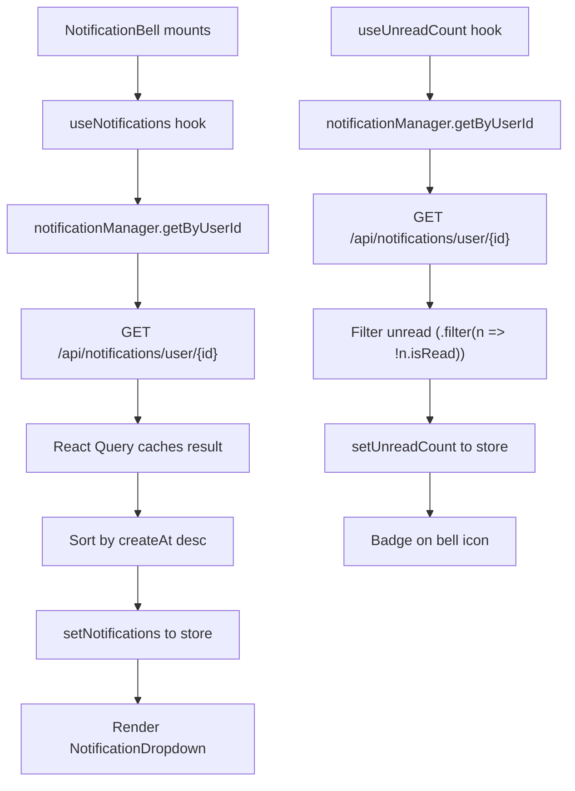
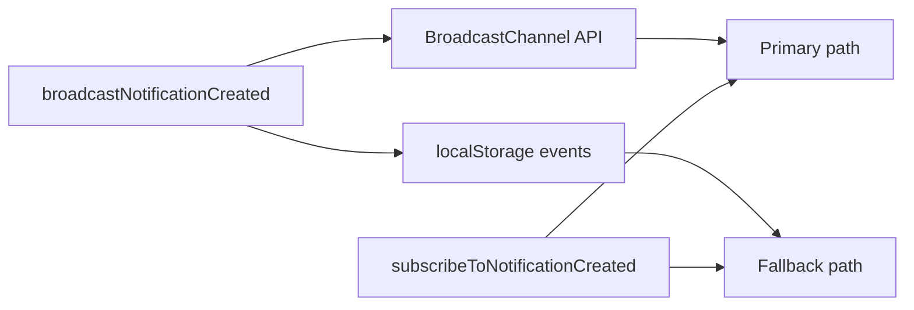
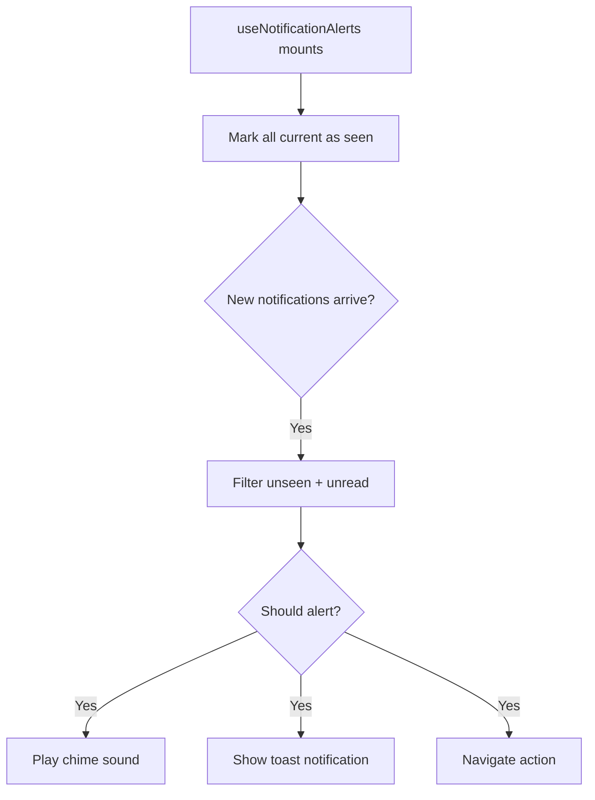
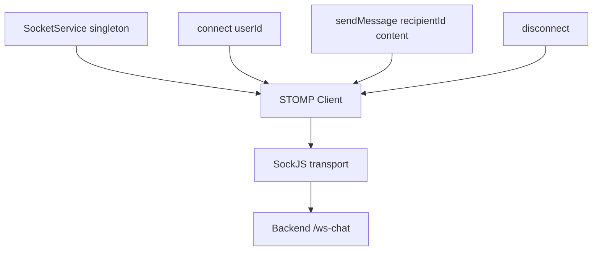
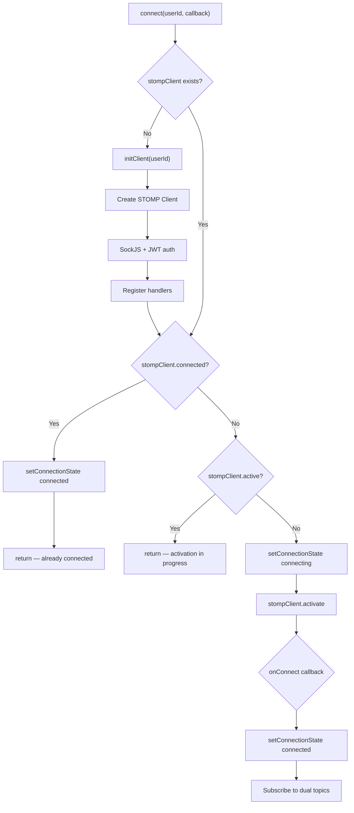
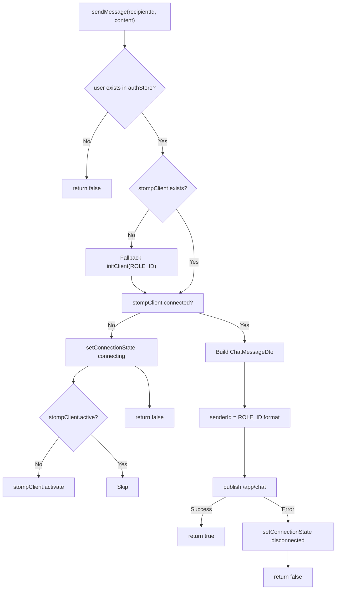
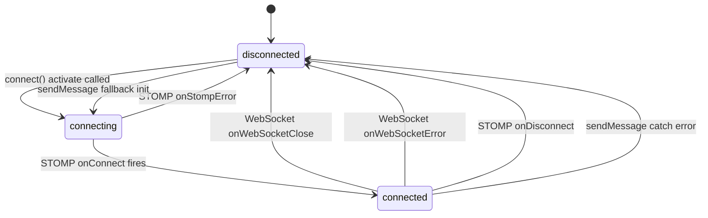

# Notification Feature

> **Source:** `src/components/notification/`, `src/hooks/useNotification.ts`, `src/hooks/useNotificationAlerts.ts`, `src/lib/notification-alert-bus.ts`, `src/services/socket.manager.ts`  
> **Last Synced:** 2026-06-05

---

## 1. Overview

The notification system has two distinct subsystems:

1. **Notification CRUD** — REST-based notifications (polling every 15s)
2. **Real-time Chat** — WebSocket (STOMP over SockJS) for live messaging

---

## 2. Notification Component Map

| File                          | Purpose                                     |
| ----------------------------- | ------------------------------------------- |
| `NotificationBell.tsx`        | Bell icon badge in dashboard header         |
| `NotificationDropdown.tsx`    | Dropdown showing 5 recent notifications     |
| `NotificationList.tsx`        | Reusable notification list with empty state |
| `NotificationItem.tsx`        | Single notification row                     |
| `NotificationDetailModal.tsx` | Full notification detail modal              |

---

## 3. REST Notification System

### Data Flow



**⚠️ Dual-query pattern**: Both `useNotifications` and `useUnreadCount` make **independent** API calls to the same endpoint (`GET /api/notifications/user/{id}`) with identical polling config. This means two parallel requests every 15 seconds. Both queries share the same `enabled: !!user?.id` guard and the same polling/stale/refetch settings. The unread count is computed client-side by filtering the response for `!n.isRead`.

### `useCreateNotification` → Cross-Tab Broadcast

When an admin creates a notification, it broadcasts to all tabs:

```typescript
useCreateNotification() → notificationManager.create({ user, title, message })
  → broadcastNotificationCreated(createdNotification) // Cross-tab
  → invalidateQueries(NOTIFICATION_QUERY_KEYS.all)    // Invalidate all notification queries
```

The `broadcastNotificationCreated` call triggers the `subscribeToNotificationCreated` listener in `useNotificationAlerts` across all open tabs — even tabs where the React Query hasn't refetched yet.

### Polling Configuration

```typescript
{
  refetchInterval: 15000,    // Poll every 15 seconds
  staleTime: 5000,           // Data considered fresh for 5s
  refetchOnWindowFocus: true,
  refetchOnReconnect: true,
}
```

### Query Keys

```typescript
NOTIFICATION_QUERY_KEYS = {
  all: ["notifications"],
  byUser: (userId) => ["notifications", "user", userId],
  unreadCount: (userId) => ["notifications", "unread", userId],
};
```

---

## 4. Notification Operations

### Mark as Read

```typescript
// Single
useMarkAsRead() → notificationManager.markAsRead(id)
  → Optimistic: markAsRead(id) in store
  → Refetch: invalidateQueries(byUser + unreadCount)

// Bulk (mark all)
useMarkAllAsRead() → Promise.allSettled(markAsRead for each)
  → Optimistic: markAllAsRead() in store
  → Refetch: invalidateQueries
  → Partial failure toast: "X/Y marked as read"
```

### Create Notification (Admin)

```typescript
useCreateNotification() → notificationManager.create({ user, title, message })
  → broadcastNotificationCreated(notification)  // Cross-tab broadcast
  → invalidateQueries(all)
```

---

## 5. Real-Time Alert System

### NotificationAlertBus (`src/lib/notification-alert-bus.ts`)

Cross-tab notification broadcasting using two mechanisms:



- **Primary**: `BroadcastChannel("inblue-fe:notification-alerts")`
- **Fallback**: `localStorage` set/remove event (for browsers without BroadcastChannel)

### useNotificationAlerts Hook



Features:

- **`enabled` parameter**: Defaults to `true`. When `false`, disables both the polling effect and the cross-tab subscription — useful for contexts where notifications should be suppressed (e.g., during video calls)
- **Sound chime**: Dual-tone sine wave via `AudioContext` (880Hz + 1175Hz)
- **Sound cooldown**: 1500ms between chimes
- **Toast**: `toast.info()` with action button → navigate to notifications tab
- **Seen tracking**: `useRef<Set<number>>` prevents duplicate alerts
- **User filtering**: Only alerts for current user's notifications (checks `notification.user?.id !== currentUserId`)
- **ID validation**: `isValidNotificationId()` rejects `null`, `undefined`, non-finite, and `<= 0` IDs
- **Mute settings**: Respects `muteSoundNotification` and `muteToastNotification` from settings store
- **Read filtering**: Skips notifications where `notification.isRead === true`

### Batch Notification Summarization

When multiple notifications arrive simultaneously (e.g., initial load or batch poll), the hook **summarizes** them into a single toast rather than showing one toast per notification.

**Title generation** (`getNotificationSummaryTitle`):

| Notification Count | Title                                                         |
| ------------------ | ------------------------------------------------------------- |
| 0–1                | Notification's own `title` (or `"New announcement"` fallback) |
| 2+                 | `t("general.youHaveNewNotifications", { count })`             |

**Description generation** (`getNotificationSummaryDescription`):

| Notification Count | Description                                            |
| ------------------ | ------------------------------------------------------ |
| 0–1                | `truncateMessage(notification.message)`                |
| 2+                 | `"{latest.title} · {truncateMessage(latest.message)}"` |

For multiple notifications, the "latest" is determined by sorting by `createAt` descending (using `toTimestamp()` for safe date parsing).

```typescript
const getNotificationSummaryTitle = (notifications: Notification[]): string => {
  if (notifications.length <= 1) {
    return notifications[0]?.title?.trim() || t("general.newAnnouncement");
  }
  return t("general.youHaveNewNotifications", { var_0: notifications.length });
};

const getNotificationSummaryDescription = (notifications: Notification[]): string => {
  if (notifications.length <= 1) {
    return truncateMessage(notifications[0]?.message);
  }
  const latest = [...notifications].sort(
    (a, b) => toTimestamp(b.createAt) - toTimestamp(a.createAt)
  )[0];
  return latest?.title
    ? `${latest.title} · ${truncateMessage(latest.message)}`
    : truncateMessage(latest.message);
};
```

**Message truncation** (`truncateMessage`): Limits notification messages to **140 characters** to prevent overflowing the toast. Empty or whitespace-only messages fall back to `t("general.youHaveJustReceivedA")`:

```typescript
const MAX_TOAST_MESSAGE_LENGTH = 140;

const truncateMessage = (message?: string): string => {
  const trimmed = message?.trim();
  if (!trimmed) {
    return t("general.youHaveJustReceivedA");
  }
  if (trimmed.length <= MAX_TOAST_MESSAGE_LENGTH) {
    return trimmed;
  }
  return `${trimmed.slice(0, MAX_TOAST_MESSAGE_LENGTH - 1).trimEnd()}…`;
};
```

Note: Uses `…` (Unicode ellipsis, U+2026) not `...` (three dots). The `-1` slice leaves room for the ellipsis character. `trimEnd()` removes any trailing whitespace from the sliced portion.

### Dual-Source Architecture

The hook processes notifications from **two sources** through the same `handleNotificationBatch` pipeline:

```typescript
// Source 1: React Query polling (every 15s via useNotifications)
useEffect(() => {
  if (!initializedRef.current) {
    // First load: mark ALL current as seen (no alerts on mount)
    notifications.forEach(markNotificationAsSeen);
    initializedRef.current = true;
    return;
  }
  // Subsequent loads: alert only for NEW unseen notifications
  handleNotificationBatch(notifications);
}, [notifications]);

// Source 2: Cross-tab broadcast (real-time via notification-alert-bus)
useEffect(() => {
  return subscribeToNotificationCreated((notification) => {
    handleNotificationBatch([notification]);
  });
}, []);
```

Both sources feed into the same dedup pipeline — the `seenNotificationIdsRef` Set prevents duplicate alerts even if the same notification arrives via both paths.

### Chime Sound Implementation

The notification chime uses Web Audio API to generate a pleasant two-tone alert without any audio files. It includes `webkitAudioContext` fallback for older Safari versions:

```typescript
const playNotificationChime = async (): Promise<void> => {
  const AudioContextCtor = window.AudioContext || window.webkitAudioContext;
  if (!AudioContextCtor) return;

  const audioContext = new AudioContextCtor();
  if (audioContext.state === "suspended") {
    await audioContext.resume().catch(() => undefined);
  }

  const createTone = (frequency: number, startOffset: number, duration: number) => {
    const oscillator = audioContext.createOscillator();
    const gainNode = audioContext.createGain();
    const startTime = audioContext.currentTime + startOffset;

    oscillator.type = "sine";
    oscillator.frequency.setValueAtTime(frequency, startTime);

    // Attack → sustain → release envelope
    gainNode.gain.setValueAtTime(0.0001, startTime);
    gainNode.gain.exponentialRampToValueAtTime(0.65, startTime + 0.02); // Quick attack
    gainNode.gain.exponentialRampToValueAtTime(0.18, startTime + duration - 0.04); // Sustain
    gainNode.gain.exponentialRampToValueAtTime(0.0001, startTime + duration); // Release

    oscillator.connect(gainNode);
    gainNode.connect(audioContext.destination);
    oscillator.start(startTime);
    oscillator.stop(startTime + duration + 0.02);
  };

  createTone(880, 0, 0.18); // Tone 1: A5, starts immediately
  createTone(1175, 0.2, 0.18); // Tone 2: D#6, offset by 200ms

  // Auto-close AudioContext after 1 second
  window.setTimeout(() => {
    audioContext.close().catch(() => undefined);
  }, 1000);
};
```

Key details:

- **Attack envelope**: `exponentialRampToValueAtTime(0.65, ...)` creates a sharp attack (20ms)
- **Sustain**: Volume settles at 0.18 for the body of the tone
- **Release**: Fades to near-silence (0.0001) at the end
- **AudioContext lifecycle**: Created per call, auto-closed after 1 second — avoids state accumulation
- **Suspended state handling**: Browsers require user interaction before audio can play; `resume()` handles this
- **Async**: Returns `Promise<void>` so callers use `void playNotificationChime()` (fire-and-forget)

---

## 6. Notification Store Behavior

The `notificationStore` `addNotification` method **prepends** new notifications without dedup or cap:

```typescript
// ACTUAL source code (src/stores/notificationStore.ts)
addNotification: (notification) =>
  set((state) => ({
    notifications: [notification, ...state.notifications],
    unreadCount: notification.isRead ? state.unreadCount : state.unreadCount + 1,
  })),
```

**Key behaviors:**

- **No dedup**: Duplicate notifications (same `id`) are NOT filtered — if the same notification arrives twice, it appears twice
- **No cap**: The in-memory array grows unboundedly — there is no `.slice(0, 50)` limit
- **Field name**: Uses `notification.isRead` (NOT `notification.read`) — matching the backend `Notification` type
- **Unread counting**: Increments `unreadCount` only if the incoming notification is NOT read

**Persistence**: Only `unreadCount` is persisted via `partialize`:

```typescript
partialize: (state) => ({ unreadCount: state.unreadCount }),
```

This means:

- Notifications themselves are **transient** — they disappear on page refresh
- The full notification list is always **re-fetched from the API** via React Query polling (every 15s)
- Only the badge count survives across sessions for instant UI feedback

### `setNotifications` — Bulk Replace

```typescript
setNotifications: (notifications) =>
  set({
    notifications,
    unreadCount: notifications.filter((n) => !n.isRead).length,
  }),
```

This is the primary method used by the `useNotification` hook after each poll — it replaces the entire in-memory list and recalculates the unread count from the fresh API data.

### NotificationDropdown Rendering

The dropdown shows the **5 most recent** notifications with:

- Unread indicator (blue dot)
- Time-ago formatting (e.g., "5 phút trước")
- Click to open detail modal
- "Mark all as read" button
- Link to full notification list

The dropdown state (`isDropdownOpen`) is managed in the store to allow closing from anywhere (e.g., when clicking outside or navigating).

### Toast Configuration

Toasts include a **See Announcement** action button that navigates to the notifications tab:

```typescript
toast.info(summaryTitle, {
  description: summaryDescription,
  duration: 6000, // 6 seconds — longer than default for readability
  action: {
    label: t("general.seeAnnouncement"),
    onClick: () => navigate(notificationsPath),
  },
});
```

The `notificationsPath` is configurable per dashboard role — defaults to `/user?tab=notifications` but can be overridden to `/mentor?tab=notifications`.

### Notification Batch Summary Logic

When multiple notifications arrive simultaneously, the hook creates a summary:

```typescript
// Single notification: show its title + message
// Multiple notifications: show count + latest message
const getNotificationSummaryTitle = (notifications: Notification[]): string => {
  if (notifications.length <= 1) {
    return notifications[0]?.title?.trim() || t("general.newAnnouncement");
  }
  return t("general.youHaveNewNotifications", { var_0: notifications.length });
};

const getNotificationSummaryDescription = (notifications: Notification[]): string => {
  if (notifications.length <= 1) {
    return truncateMessage(notifications[0]?.message);
  }
  const latest = [...notifications].sort(
    (a, b) => toTimestamp(b.createAt) - toTimestamp(a.createAt)
  )[0];
  return latest?.title
    ? `${latest.title} · ${truncateMessage(latest.message)}`
    : truncateMessage(latest.message);
};
```

Toast messages are truncated at **140 characters** to prevent UI overflow. Empty or missing messages fall back to `t("general.youHaveJustReceivedA")`.

### Initialization vs Update

The hook distinguishes between the initial load and subsequent updates using an `initializedRef`:

```typescript
useEffect(() => {
  if (!initializedRef.current) {
    // First load: mark ALL current notifications as seen (no alerts)
    notifications.forEach(markNotificationAsSeen);
    initializedRef.current = true;
    return;
  }
  // Subsequent updates: only alert for NEW unseen notifications
  handleNotificationBatch(notifications);
}, [notifications]);
```

This prevents a flood of alerts when the user first opens the app with existing unread notifications.

---

## 6. WebSocket Chat System

### Architecture



### Configuration

```typescript
{
  webSocketFactory: () => new SockJS(`${API_BASE_URL}/ws-chat?token=${token}`),
  connectHeaders: { Authorization: `Bearer ${token}` },
  reconnectDelay: 5000,
  heartbeatIncoming: 4000,
  heartbeatOutgoing: 4000,
}
```

**Dual-auth mechanism**: JWT token is passed via **both** SockJS URL query param (`?token=`) AND STOMP `connectHeaders` (`Authorization: Bearer`). This ensures auth works regardless of whether the backend checks the URL param or the STOMP header.

### Connection Lifecycle



**Guard logic in `connect()`:**

| Guard                  | Condition                | Action                                   |
| ---------------------- | ------------------------ | ---------------------------------------- |
| No client              | `!stompClient`           | Call `initClient()` to create            |
| Already connected      | `stompClient?.connected` | Set state to connected, return           |
| Activation in progress | `stompClient?.active`    | Skip activation, return                  |
| Ready to connect       | `!stompClient?.active`   | Set state to connecting, call `activate` |

### Lazy Initialization

`initClient()` is called lazily on first `connect()` — not at module load. This means the STOMP client, SockJS connection, and event handlers are all created on-demand:

```typescript
private initClient(userId: string) {
  const token = useAuthStore.getState().token;
  const socketUrl = token
    ? `${API_BASE_URL}/ws-chat?token=${token}`
    : `${API_BASE_URL}/ws-chat`;

  this.stompClient = new Client({
    webSocketFactory: () => new SockJS(socketUrl),
    connectHeaders: token ? { Authorization: `Bearer ${token}` } : {},
    reconnectDelay: 5000,
    heartbeatIncoming: 4000,
    heartbeatOutgoing: 4000,
  });

  this.stompClient.onConnect = (frame) => {
    this.setConnectionState("connected");
    const subUserId = this.currentUserId || userId;
    const topics = [
      `/user/${subUserId}/queue/messages`,
      `/user/${subUserId}/topic/messages`,
    ];
    topics.forEach((topic) => {
      this.stompClient?.subscribe(topic, (message: Message) => {
        if (message.body && this.onMessageReceived) {
          try {
            this.onMessageReceived(JSON.parse(message.body));
          } catch (e) {
            console.error("STOMP parse error", e);
          }
        }
      });
    });
  };
  // ...error/close handlers
}
```

**Dual subscription**: Both `/user/{id}/queue/messages` and `/user/{id}/topic/messages` are subscribed to — the backend may route messages to either destination depending on whether they are targeted (queue) or broadcast (topic).

### Topics

- `/user/{userId}/queue/messages`
- `/user/{userId}/topic/messages`

### Message Format

```typescript
interface ChatMessageDto {
  id?: string | number;
  senderId: string; // Format: "ROLE_ID" (e.g., "USER_5")
  recipientId: string; // Format: "ROLE_ID"
  recipientType?: string;
  content: string;
  timestamp?: string;
  senderType?: string;
}
```

### `sendMessage` Lifecycle



**Key behaviors:**

- **Fallback initialization**: If `sendMessage` is called before `connect()` (or after a disconnect), it creates a new STOMP client on the fly using the user's `ROLE_ID` format
- **ROLE_ID format**: Both `senderId` and `recipientId` use `"ROLE_ID"` format (e.g., `"USER_5"`, `"MENTOR_12"`), constructed from `user.role.toUpperCase() + "_" + user.id`
- **Graceful failure**: If the socket isn't connected, it attempts activation but returns `false` immediately — the message is NOT queued for later delivery
- **Error handling**: Publish errors set connection state to `disconnected` and return `false`

```typescript
sendMessage(recipientId: string, content: string): boolean {
  const user = useAuthStore.getState().user;
  if (!user) return false;

  // Fallback: create client if missing
  if (!this.stompClient) {
    const fullId = `${user.role?.toUpperCase()}_${user.id}`;
    this.initClient(fullId);
  }

  // Guard: must be connected
  if (!this.stompClient?.connected) {
    if (!this.stompClient?.active) this.stompClient?.activate();
    return false; // Not queued — fire-and-forget
  }

  const senderId = useAuthStore.getState().user?.id;
  const senderRole = useAuthStore.getState().user?.role?.toUpperCase();
  if (!senderId || !senderRole) return false;

  const chatDto: ChatMessageDto = {
    senderId: `${senderRole}_${senderId}`,
    recipientId: recipientId,
    content: content,
  };

  try {
    this.stompClient.publish({
      destination: "/app/chat",
      body: JSON.stringify(chatDto),
    });
    return true;
  } catch (error) {
    this.setConnectionState("disconnected");
    return false;
  }
}
```

### Connection States



State transitions are driven by STOMP client event callbacks:

| Event               | New State      | Trigger                                   |
| ------------------- | -------------- | ----------------------------------------- |
| `onConnect`         | `connected`    | STOMP handshake successful                |
| `onStompError`      | `disconnected` | Broker error (headers["message"])         |
| `onWebSocketClose`  | `disconnected` | TCP connection closed (event.code logged) |
| `onWebSocketError`  | `disconnected` | WebSocket-level error                     |
| `onDisconnect`      | `disconnected` | STOMP disconnect command                  |
| `sendMessage` catch | `disconnected` | Publish throws error                      |

### Singleton Pattern

```typescript
export const socketService = new SocketService();
```

The `SocketService` class is a singleton — only one WebSocket connection exists at a time. Reconnection is handled by STOMP client with 5-second delay.

### `disconnect()`

```typescript
disconnect() {
  if (this.stompClient) {
    this.stompClient.deactivate();
    this.setConnectionState("disconnected");
  }
}
```

- Calls `deactivate()` on the STOMP client — this closes the underlying WebSocket
- Does NOT null out `stompClient` — a subsequent `connect()` will reuse the existing client instance
- Does NOT clear `onMessageReceived` callback — callback persists for potential reconnect

### Error Handling Chain

All four error paths converge on `setConnectionState("disconnected")`:

```typescript
// STOMP protocol error
this.stompClient.onStompError = (frame) => {
  this.setConnectionState("disconnected");
  console.error("STOMP broker error", frame.headers["message"], frame.body);
};

// WebSocket closed
this.stompClient.onWebSocketClose = (event) => {
  this.setConnectionState("disconnected");
  console.warn("WebSocket closed", event.code);
};

// WebSocket error
this.stompClient.onWebSocketError = (event) => {
  this.setConnectionState("disconnected");
  console.error("WebSocket error", event);
};

// STOMP disconnect
this.stompClient.onDisconnect = () => {
  this.setConnectionState("disconnected");
};
```

The STOMP client's built-in `reconnectDelay: 5000` handles automatic reconnection after these errors — the `SocketService` itself does NOT implement custom retry logic.

---

## 7. Notification Store Interface

```typescript
interface NotificationState {
  // State
  notifications: Notification[];
  unreadCount: number;
  isDropdownOpen: boolean;

  // Actions
  setNotifications: (notifications: Notification[]) => void;
  setUnreadCount: (count: number) => void;
  incrementUnread: () => void;
  decrementUnread: () => void;
  markAsRead: (id: number) => void;
  markAllAsRead: () => void;
  toggleDropdown: () => void;
  closeDropdown: () => void;
  addNotification: (notification: Notification) => void;
}
```

**Storage key:** `notification-storage`
**Persisted fields:** `unreadCount` only (via `partialize`)

---

_Document generated from source code analysis on 2026-06-05._
